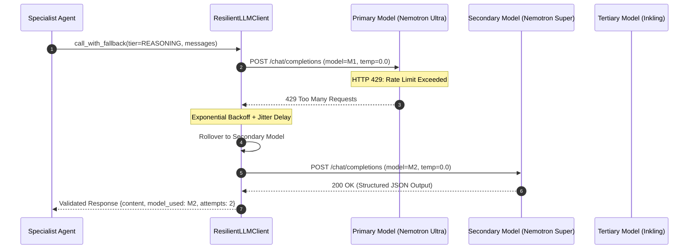
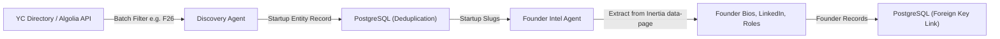
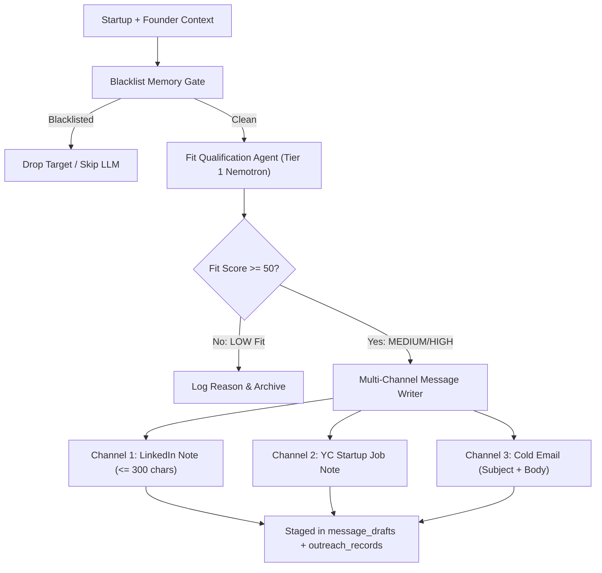

# YC Agentic Founder Outreach & Startup Discovery System
## Master Architecture Blueprint, System Design & Implementation Plan

> **System Status**: Phase 1 (Foundation, Multi-Tier Memory Engine & Tool Architecture) is **COMPLETED & VERIFIED (14/14 Tests Passing)**.  
> **Target Environment**: Local Python Virtual Environment (`.venv`), OpenRouter Free Tier API, PostgreSQL (Business & Explicit Memory) + Redis (Session & Cache Memory) with automated local SQLite/In-Memory fallback.

---

## Table of Contents
1. [Product Vision, Operational Model & Core Philosophy](#1-product-vision-operational-model--core-philosophy)
2. [End-to-End System Architecture (Lucid Diagram)](#2-end-to-end-system-architecture-lucid-diagram)
3. [Broad Agent Hierarchy & Master Dispatch Engine](#3-broad-agent-hierarchy--master-dispatch-engine)
4. [OpenRouter Model Tiering & Dynamic Fallback Engine](#4-openrouter-model-tiering--dynamic-fallback-engine)
5. [4-Tier Stateful Memory Engine](#5-4-tier-stateful-memory-engine)
6. [Decoupled Tool Contract & Schema Architecture](#6-decoupled-tool-contract--schema-architecture)
7. [System Directory Tree & File Manifest](#7-system-directory-tree--file-manifest)
8. [Phase-by-Phase Comprehensive Build Specifications](#8-phase-by-phase-comprehensive-build-specifications)
   - [Phase 1: Foundation, Schemas & Persistent Memory Engine (COMPLETED)](#phase-1-system-foundation-schemas--persistent-memory-engine-completed)
   - [Phase 2: Data Harvesting & Founder Intelligence Agents](#phase-2-data-harvesting--founder-intelligence-agents)
   - [Phase 3: Fit Qualification & Multi-Channel Message Generation](#phase-3-fit-qualification--multi-channel-message-generation)
   - [Phase 4: Broad Orchestration & Pipeline Execution](#phase-4-broad-orchestration--pipeline-execution)
   - [Phase 5: Human Approval Gate & Interactive Web Dashboard](#phase-5-human-approval-gate--interactive-web-dashboard)
   - [Phase 6: Automation Scheduler & Production Hardening](#phase-6-automation-scheduler--production-hardening)
9. [Data Models & Schema Reference Table](#9-data-models--schema-reference-table)
10. [Verification, Guardrails & Testing Protocol](#10-verification-guardrails--testing-protocol)

---

## 1. Product Vision, Operational Model & Core Philosophy

### The Problem
Finding early-stage YC founders looking for founding engineers or key early hires currently requires 20+ hours of manual labor every week:
1. Manually crawling YC's directory for recent batches (`F26`, `S26`, `W26`).
2. Sifting through hundreds of company pages to identify relevant domains (AI, Developer Tools, B2B SaaS).
3. Searching for founder LinkedIn profiles, verifying identities, and reading bios.
4. Cross-referencing against personal outreach history to avoid embarrassing duplicate messages.
5. Manually scoring whether the candidate's skills match the company's technical stack.
6. Writing personalized connection notes and emails from scratch.

### The Solution: An Autonomous Agent Fleet with Human-in-the-Loop Gate
This product transforms manual outreach into an automated, highly selective intelligence workflow:
- **Autonomous Perception**: Ingests new YC batch startups, filters target industries, and extracts verified founder dossiers.
- **Cognitive Evaluation**: Compares company mission and founder background against candidate profile facts to compute an objective 0–100 match score with concrete contribution rationales.
- **Strict Grounding**: Message generator drafts personalized copy across 3 distinct channels (LinkedIn Note <= 300 chars, YC Job Note, Cold Email) grounded strictly in verified facts. No hallucinated claims or AI fluff.
- **Human Approval Gate**: Never automates direct sending. All drafts are queued in a visual dashboard for one-click approval, copy-to-clipboard, or direct LinkedIn profile launching.
- **Zero Token Waste (Plan-and-Solve)**: Deterministic code controls pipeline orchestration, caching, and state transitions; LLM reasoning is invoked strictly when cognitive judgment is mandatory.

---

## 2. End-to-End System Architecture (Lucid Diagram)

```mermaid
flowchart TD
    subgraph TriggerLayer["01. TRIGGER & STIMULUS LAYER"]
        CRON["Automated Periodic Scheduler (Phase 6)"]
        CLI["Developer CLI Runner (Phase 4)"]
        WEB["FastAPI REST Trigger (Phase 5)"]
    end

    subgraph OrchestratorLayer["02. MASTER ORCHESTRATION & DISPATCH"]
        MASTER["Master Pipeline Orchestrator (Hybrid Dispatch)"]
        ROUTER{"Task Type Classifier"}
        CODE_ROUTE["Deterministic Code Graph (Plan-and-Solve)"]
        LLM_ROUTE["Master LLM Reasoner (Ambiguous Stimuli)"]
    end

    subgraph HarvestingFleet["03. DATA HARVESTING FLEET (Phase 2)"]
        DISC_AGENT["YC Startup Discovery Agent"]
        FOUNDER_AGENT["Founder Intel & Social Extraction Agent"]
        ALGOLIA["YC Algolia Public API"]
        INERTIA["YC Inertia.js Data-Page JSON"]
    end

    subgraph MemoryEngine["04. 4-TIER STATEFUL MEMORY ENGINE (Phase 1)"]
        REDIS_SESSION[("Redis: Session Memory (DAG State / Handoffs)")]
        REDIS_CACHE[("Redis: Cache Memory (Tool Results TTL)")]
        PG_BUSINESS[("PostgreSQL: Business Memory (Entities & Blacklist)")]
        PG_EXPLICIT[("PostgreSQL: Explicit Memory (Candidate Profile)")]
        PG_IMPLICIT[("PostgreSQL: Implicit Memory (Founder Heuristics)")]
        BLACKLIST{"Never Contact Again Blacklist Check"}
    end

    subgraph ReasoningFleet["05. REASONING & GENERATION FLEET (Phase 3)"]
        FIT_AGENT["Fit Qualification Agent (Score 0-100)"]
        MSG_AGENT["Multi-Channel Grounded Message Writer"]
        LLM_FALLBACK["OpenRouter Resilient Fallback Engine"]
    end

    subgraph HumanGate["06. HUMAN APPROVAL GATE & DASHBOARD (Phase 5)"]
        API_SERVER["FastAPI Control Endpoints"]
        DASHBOARD["Interactive Web Dashboard"]
        REVIEW_CARD["Review Lead Dossier (Fit Rationale + 3 Drafts)"]
        ACTIONS["[ Approve & Launch LinkedIn ] / [ Edit ] / [ Blacklist ]"]
    end

    subgraph ManualDelivery["07. OUTREACH EXECUTION & TRACKING"]
        MANUAL_SEND["Candidate Manually Sends Grounded Message"]
        TRACKER["Outreach State: Draft -> Approved -> Sent -> Replied"]
    end

    %% Flow Connections
    CRON --> MASTER
    CLI --> MASTER
    WEB --> MASTER

    MASTER --> ROUTER
    ROUTER -->|Known Sequence| CODE_ROUTE
    ROUTER -->|Ambiguous Stimulus| LLM_ROUTE

    CODE_ROUTE --> DISC_AGENT
    DISC_AGENT <--> ALGOLIA
    DISC_AGENT --> REDIS_CACHE
    DISC_AGENT --> PG_BUSINESS

    DISC_AGENT --> FOUNDER_AGENT
    FOUNDER_AGENT <--> INERTIA
    FOUNDER_AGENT --> REDIS_CACHE
    FOUNDER_AGENT --> PG_BUSINESS

    FOUNDER_AGENT --> BLACKLIST
    BLACKLIST -->|Match Found: STOP| PG_BUSINESS
    BLACKLIST -->|Clean Entity: PROCEED| FIT_AGENT

    FIT_AGENT <--> PG_EXPLICIT
    FIT_AGENT <--> LLM_FALLBACK
    FIT_AGENT --> PG_BUSINESS

    FIT_AGENT -->|Score >= 50| MSG_AGENT
    MSG_AGENT <--> LLM_FALLBACK
    MSG_AGENT --> PG_BUSINESS

    PG_BUSINESS --> API_SERVER
    API_SERVER <--> DASHBOARD
    DASHBOARD --> REVIEW_CARD
    REVIEW_CARD --> ACTIONS
    ACTIONS --> MANUAL_SEND
    ACTIONS --> PG_BUSINESS
    MANUAL_SEND --> TRACKER
    TRACKER --> PG_IMPLICIT
```



---

## 3. Broad Agent Hierarchy & Master Dispatch Engine

Instead of a narrow, deep hierarchy where agents call agents in a fragile chain, the system utilizes a **Broad Agent Hierarchy**. A central Master Orchestrator receives incoming stimuli, evaluates context, and directly dispatches tasks to qualified domain-specialist agents.

```text
                                 ┌───────────────────────────────────┐
                                 │     MASTER ORCHESTRATOR           │
                                 │   (Hybrid Routing & Dispatch)     │
                                 └─────────────────┬─────────────────┘
                                                   │
         ┌───────────────────┬─────────────────────┼─────────────────────┬───────────────────┐
         │                   │                     │                     │                   │
         ▼                   ▼                     ▼                     ▼                   ▼
┌─────────────────┐ ┌─────────────────┐   ┌─────────────────┐   ┌─────────────────┐ ┌─────────────────┐
│ Discovery Agent │ │ Founder Agent   │   │  Blacklist Gate │   │ Fit Qual Agent  │ │ Message Writer  │
│ (Domain: YC     │ │ (Domain: Social │   │  (Domain: Memory│   │ (Domain: Match  │ │ (Domain: Grounded│
│ Directory Crawl)│ │ Bio Extraction) │   │   Verification) │   │  Scoring 0-100) │ │  Copy Generation│
└─────────────────┘ └─────────────────┘   └─────────────────┘   └─────────────────┘ └─────────────────┘
```

### Hybrid Dispatch Decision Matrix
- **Deterministic Code Dispatch**: When orchestrating known pipeline stages (`Discovery -> Founder Intel -> Blacklist Check -> Fit Assessment -> Message Drafting`), task transitions run purely in Python code. Zero tokens are wasted on orchestration overhead.
- **Master LLM Reasoning Dispatch**: When incoming events are unstructured (e.g. ad-hoc user query, unexpected scraper schema change, re-ranking candidate priorities, or custom trigger parameters), the Master Agent uses Tier 1 reasoning models to analyze the stimulus and delegate to the qualified specialist.

---

## 4. OpenRouter Model Tiering & Dynamic Fallback Engine

To maintain high reasoning quality while operating under zero-cost constraints, the system targets **OpenRouter's free model tier** with a built-in, multi-model fallback chain.

### Model Catalog by Capability Tier

| Tier | Capability Focus | Primary Model | Secondary Fallback | Tertiary Fallback |
|---|---|---|---|---|
| **Tier 1: Deep Reasoning** | Fit evaluation, trade-off scoring, complex planning, candidate contribution analysis | `nvidia/nemotron-3-ultra-550b-a55b:free` | `nvidia/nemotron-3-super-120b-a12b:free` | `thinkingmachines/inkling:free` |
| **Tier 2: Extraction & Tools** | Parsing messy HTML/JSON, structured data extraction, tool calling, JSON mode | `google/gemma-4-31b-it:free` | `google/gemma-4-26b-a4b-it:free` | `dots-studio/dots3-note-preview:free` |
| **Tier 3: Fast Routing** | Quick classification, text cleanup, heuristic filtering, intent categorization | `inclusionai/ling-3.0-flash:free` | `google/gemma-4-26b-a4b-it:free` | N/A |

### Resilience & Rollover Architecture



---

## 5. 4-Tier Stateful Memory Engine

Agents are strictly **stateful**. Memory is divided across four distinct functional tiers:

```
┌────────────────────────────────────────────────────────────────────────────────────────┐
│                               4-TIER STATEFUL MEMORY                                   │
├────────────────────────────────┬───────────────────────────────────────────────────────┤
│ 1. SESSION MEMORY (Redis)      │ Ephemeral DAG execution state, active run parameters,  │
│                                │ Master-to-Specialist handoff tokens. TTL: 24h.         │
├────────────────────────────────┼───────────────────────────────────────────────────────┤
│ 2. CACHE MEMORY (Redis)        │ Deterministic tool output cache keyed by MD5 hash of   │
│                                │ arguments. Eliminates duplicate web queries. TTL: 1h-7d│
├────────────────────────────────┼───────────────────────────────────────────────────────┤
│ 3. BUSINESS MEMORY (Postgres)  │ Permanent relational ground truth: Startups, Founders, │
│                                │ Fit Evaluations, Outreach Records, and Blacklist.     │
├────────────────────────────────┼───────────────────────────────────────────────────────┤
│ 4. EXPLICIT & IMPLICIT MEMORY  │ Explicit: Candidate skills, pitch angles, preferences. │
│    (Postgres JSONB)            │ Implicit: Learned founder response rates and patterns. │
└────────────────────────────────┴───────────────────────────────────────────────────────┘
```

### The "Never Contact Again" Blacklist Memory Check
Before any fit scoring or message drafting occurs, the system queries the `blacklist` table across four distinct identifiers:
1. `founder_name` (case-insensitive exact match)
2. `linkedin_url` (canonical profile URL match)
3. `company_name` (startup name match)
4. `domain` (normalized website domain)

If a match is found in Business Memory, the pipeline **instantly short-circuits** for that target entity. Zero LLM tokens are consumed, and no duplicate outreach is possible.

---

## 6. Decoupled Tool Contract & Schema Architecture

Following the `agent-architecture-advisor` framework:
- **The Schema is the Advertisement**: Stored in modular JSON files per agent (`tools/schemas/*.json`), formatted to the OpenAI Function Calling specification with expressive descriptions and strict constraints.
- **The Python Engine is the Fulfillment**: Implemented in `tools/engine.py`. Arguments are defensive-checked at runtime, and all executions return a standardized dictionary contract:

```python
{
    "success": bool,
    "result": Any,          # Payload data on success
    "error": Optional[str], # Clear description if failed
    "error_type": Optional[str] # "validation_error" | "system_error" | "not_found_error"
}
```

---

## 7. System Directory Tree & File Manifest

```text
Y Cominator(Agents)/
├── .venv/                                # Local Python virtual environment (isolated packages)
├── config/                               # Central configuration & explicit knowledge base
│   ├── __init__.py                       # Package exports
│   ├── settings.py                       # Pydantic BaseSettings, paths, model catalog
│   ├── llm_client.py                     # Resilient OpenRouter client + fallback engine
│   └── profile.json                      # Candidate Explicit Memory knowledge base
│
├── tools/                                # Decoupled Tool System
│   ├── __init__.py                       # Package exports
│   ├── engine.py                         # Standardized Tool Engine & dispatcher
│   └── schemas/                          # Grouped OpenAI Function Schema definitions
│       ├── __init__.py
│       ├── discovery_tools.json          # Search & Batch crawl schemas
│       ├── founder_tools.json            # Profile & Social extraction schemas
│       ├── fit_tools.json                # Qualification evaluation schemas
│       └── outreach_tools.json           # Blacklist & Message generation schemas
│
├── db/                                   # 4-Tier Memory & Relational Storage Layer
│   ├── __init__.py                       # Package exports
│   ├── connection.py                     # Postgres/SQLite context manager & Redis/InMemory client
│   ├── models.py                         # Pydantic runtime models for all system entities
│   ├── memory.py                         # Session & Cache Memory Manager (Redis)
│   └── storage.py                        # Business Memory operations & Blacklist Engine
│
├── data/                                 # Local storage artifacts (created at runtime)
│   └── outreach.db                       # Local SQLite database fallback
│
├── tests/                                # Comprehensive test suite (Zero live API cost)
│   ├── __init__.py
│   ├── test_config.py                    # Settings & profile validation tests
│   ├── test_fallback.py                  # HTTP 429 model rollover simulation tests
│   ├── test_tools.py                     # Tool schema loading & execution tests
│   ├── test_memory.py                    # Session & tool cache lifecycle tests
│   └── test_storage.py                   # Schema creation, CRUD & Blacklist engine tests
│
├── Specs/                                # Spec-Driven Development documentation
│   ├── phase1_foundation/
│   │   └── spec.md                       # Comprehensive Phase 1 Spec (COMPLETED)
│   ├── phase2_data_harvesting/           # Phase 2 Spec & deliverables
│   ├── phase3_fit_and_messaging/         # Phase 3 Spec & deliverables
│   ├── phase4_orchestration/             # Phase 4 Spec & deliverables
│   ├── phase5_dashboard/                 # Phase 5 Spec & deliverables
│   └── phase6_automation/                # Phase 6 Spec & deliverables
│
├── requirements.txt                      # Project dependency specification
├── IMPLEMENTATION_PLAN.md                # Master Architecture & Knowledge Blueprint (this file)
└── YC-Combinator Agenrs.txt              # Original product vision & requirements document
```

---

## 8. Phase-by-Phase Comprehensive Build Specifications

---

### PHASE 1: System Foundation, Schemas & Persistent Memory Engine
**Status**: `COMPLETED & VERIFIED` (14/14 automated tests passing in `.venv`).

#### Deliverables Built
1. **Central Settings & Environment (`config/settings.py`)**: Validates `.env` variables, sets up priority chains for OpenRouter free models, and establishes base directories.
2. **Resilient LLM Client (`config/llm_client.py`)**: Executes chat completions across fallback chains with automatic rollover on HTTP 429/503.
3. **Candidate Explicit Knowledge Base (`config/profile.json`)**: Structured facts, skills, portfolio projects, and tailored pitch angles.
4. **Decoupled Tool Engine (`tools/engine.py` & `tools/schemas/*.json`)**: Grouped JSON tool schemas for all downstream agents with defensive execution contracts.
5. **Typed Pydantic Data Contracts (`db/models.py`)**: `Startup`, `Founder`, `FitEvaluation`, `MessageDrafts`, `OutreachRecord`, `BlacklistEntry`, `ImplicitInsight`.
6. **Session & Cache Memory Manager (`db/memory.py`)**: Ephemeral run state and parameter-hashed tool result caching in Redis.
7. **Business Memory & Blacklist Engine (`db/storage.py`)**: Relational tables, deduplication queries, aggregate dashboard stats, and multi-identifier exclusion checks.

---

### PHASE 2: Data Harvesting & Founder Intelligence Agents
**Status**: `COMPLETED & VERIFIED` (62/62 tests passing across Phase 1 + Phase 2).

#### Objective
Build the perception fleet that autonomously discovers newly funded YC startups and extracts verified founder profiles, background bios, social links, and open jobs without fragile DOM scraping.



#### Spec 2.1: YC Startup Discovery Agent
- **What it builds**: `agents/discovery_agent.py`
- **Mechanism**:
  - Connects to the public YC Algolia directory API (`https://45bwzj1sgc-dsn.algolia.net/1/indexes/YCCompany_production/query`) using public read-only credentials.
  - Queries companies filtered by targeted batch (e.g. `Fall 2026`, `Summer 2026`) and domain categories (`B2B`, `Developer Tools`, `AI/ML`, `Analytics`).
  - Implements Redis cache checks (`tools/engine.py`) to skip re-querying identical batch parameters within 24 hours.
  - Deduplicates incoming startups by slug against `db/storage.py`.
- **Outputs**: Staged `startups` records in Business Memory.

#### Spec 2.2: Founder Intel & Social Extraction Agent
- **What it builds**: `agents/founder_agent.py`
- **Mechanism**:
  - Fetches the canonical company profile page (`ycombinator.com/companies/{slug}`).
  - Extracts the embedded Inertia.js JSON payload (`data-page` attribute) from the HTML. This provides **100% structured data** directly from YC's internal props:
    - Founder names, titles, bios, prior companies.
    - Verified LinkedIn profile URLs and Twitter/X handles.
    - Active job postings, role descriptions, and location requirements.
  - Normalizes LinkedIn URLs (cleans tracking parameters, ensures `https://linkedin.com/in/...` format).
  - Flags potential identity mismatches: if multiple external profiles exist, verifies company name overlap before saving.
- **Outputs**: Staged `founders` records linked via foreign keys to their respective startup.

---

### PHASE 3: Fit Qualification & Multi-Channel Message Generation
**Status**: `PENDING PHASE 2 COMPLETION`.

#### Objective
Build the cognitive layer that objectively assesses candidate-to-startup relevance and crafts tailored, grounded outreach messages across three distinct channels.



#### Spec 3.1: Candidate Matching & Fit Qualification Agent
- **What it builds**: `agents/fit_agent.py`
- **Mechanism**:
  - Gathers candidate explicit knowledge (`config/profile.json`) and startup/founder dossiers.
  - Dispatches to OpenRouter Tier 1 Deep Reasoning (`nvidia/nemotron-3-ultra-550b-a55b:free`).
  - Prompt enforces a strict evaluation rubric:
    1. **Product Relevance**: Does candidate experience directly support what the startup is building?
    2. **Stage & Role Fit**: Does the startup need the candidate's target roles (Founding Engineer, Lead AI Systems)?
    3. **Evidence Requirement**: Must cite 2-3 specific facts from the founder's background or company product.
  - Outputs typed `FitEvaluation` object: `score` (0-100), `fit_tier` (`HIGH` >= 75, `MEDIUM` >= 50, `LOW` < 50), `match_rationale` (list of strings), and `contribution_angle`.

#### Spec 3.2: Multi-Channel Grounded Message Writer Agent
- **What it builds**: `agents/message_agent.py`
- **Mechanism**:
  - Operates under strict **Grounding Constraints**:
    - **Never hallucinate**: May only reference verified facts passed in the founder/company dossier.
    - **Tone**: Direct, technical, peer-to-peer, respectful, humble yet high conviction. No generic AI buzzwords ("thrilled to connect", "game-changer", "synergy").
  - Produces three distinct drafts:
    1. **LinkedIn Connection Note**: Strictly <= 300 characters, citing one concrete company hook and one relevant skill match.
    2. **YC Startup Job Note**: 1-2 paragraphs referencing the company's specific job posting and candidate project architecture.
    3. **Cold Email**: Subject line + 3-paragraph email (Hook -> Experience -> Contribution proposition).
- **Outputs**: Staged in `message_drafts` and sets `outreach_records.status = 'draft'`.

---

### PHASE 4: Broad Orchestration & Pipeline Execution
**Status**: `PENDING PHASE 3 COMPLETION`.

#### Objective
Combine individual agents into a unified, high-performance orchestration pipeline that can be executed via CLI or programmatically.

#### Spec 4.1: Master Pipeline Orchestrator
- **What it builds**: `pipeline.py` & `cli.py`
- **Mechanism**:
  - `MasterOrchestrator` runs the complete workflow:
    `Trigger -> Discovery -> Founder Intel -> Memory Verification -> Fit Assessment -> Message Drafting -> Staging`.
  - Concurrency: Executes founder extraction and fit evaluations with bounded asynchronous parallelism (e.g. `asyncio.Semaphore(5)`) to respect OpenRouter rate limits while maximizing throughput.
  - Provides rich CLI controls:
    ```bash
    python cli.py --batch "Fall 2026" --limit 20 --min-score 75
    python cli.py --blacklist-add "Spammy Founder" --reason "Unresponsive"
    python cli.py --stats
    ```

#### Spec 4.2: Integration Verification & Regression Tests
- **What it builds**: `tests/test_pipeline.py`
- **Mechanism**: End-to-end simulation test mocking external HTTP calls, validating that 10 raw startups process into verified database leads with zero state corruption.

---

### PHASE 5: Human Approval Gate & Interactive Web Dashboard
**Status**: `PENDING PHASE 4 COMPLETION`.

#### Objective
Build the user-facing command center where you review scored opportunities, inspect founder dossiers, toggle between message drafts, make 1-click approvals, and track outreach status.

```text
┌────────────────────────────────────────────────────────────────────────────────────────┐
│  YC FOUNDER OUTREACH COMMAND CENTER                                    [ Run Pipeline ]│
├───────────────────┬───────────────────┬───────────────────┬────────────────────────────┤
│ Total Startups: 42│ High Matches: 8   │ Pending Review: 8 │ Contacted: 14              │
└───────────────────┴───────────────────┴───────────────────┴────────────────────────────┘

┌────────────────────────────────────────────────────────────────────────────────────────┐
│ [High Fit: 92%]  Kailash Labs (YC Fall 2026)                                           │
│ Founder: Kailash Founder | Title: CEO & Co-Founder                                      │
│ LinkedIn: linkedin.com/in/kailash-founder                                               │
├────────────────────────────────────────────────────────────────────────────────────────┤
│ Why Relevant:                                                                          │
│ ✓ Building agentic data infrastructure with distributed task graphs                    │
│ ✓ Candidate's background in stateful orchestration directly aligns                     │
│ ✓ Currently hiring founding engineers                                                  │
├────────────────────────────────────────────────────────────────────────────────────────┤
│ [ LinkedIn Note (248/300 chars) ]   [ YC Job Note ]   [ Cold Email ]                   │
│                                                                                        │
│ "Hi Kailash, loved your recent update on agent graph orchestration at Kailash Labs.    │
│  I've been building stateful multi-agent systems cutting token overhead by 70%.       │
│  Would love to connect and follow your journey."                                       │
├────────────────────────────────────────────────────────────────────────────────────────┤
│ [ Copy Message ]   [ Launch LinkedIn & Mark Sent ]   [ Edit Draft ]   [ Blacklist ]    │
└────────────────────────────────────────────────────────────────────────────────────────┘
```

#### Spec 5.1: FastAPI Backend Application
- **What it builds**: `server.py`
- **Endpoints**:
  - `GET /api/stats`: Dashboard summary counts.
  - `GET /api/leads?status=draft&tier=HIGH`: Paginated enriched lead dossiers.
  - `POST /api/pipeline/run`: Triggers background pipeline execution.
  - `PATCH /api/outreach/{id}/status`: Transitions status (`draft -> approved -> sent -> replied -> rejected`).
  - `POST /api/blacklist`: Immediately blacklists an entity.
  - `GET/PUT /api/profile`: Reads and updates `config/profile.json`.

#### Spec 5.2: Premium Interactive Web UI
- **What it builds**: `static/index.html`, `static/style.css`, `static/app.js`
- **UI Architecture**:
  - Dark mode glassmorphism theme with modern typography (Inter/Outfit).
  - Tabbed message switcher (LinkedIn DM, YC Job Note, Cold Email) with character counters.
  - Instant copy-to-clipboard button.
  - Direct LinkedIn button that opens the founder's profile in a new tab and updates outreach state.

---

### PHASE 6: Automation Scheduler & Production Hardening
**Status**: `PENDING PHASE 5 COMPLETION`.

#### Objective
Enable the system to run on a set cadence (e.g. daily 8:00 AM scan), send desktop notifications for new high-fit leads, and provide single-command startup.

#### Spec 6.1: Automated Scheduler
- **What it builds**: `scheduler.py`
- **Mechanism**: Runs recurring cron/interval sweeps, checking for newly funded companies in target batches. Emits summary logs and notifications when `HIGH` fit leads are staged.

#### Spec 6.2: Production Launcher & Documentation
- **What it builds**: `run.py` & comprehensive `README.md`
- **Mechanism**: `python run.py` automatically initializes databases, verifies environment, runs pre-flight health checks, and launches both the backend and web UI.

---

## 9. Data Models & Schema Reference Table

| Entity / Table | Primary Key | Key Fields & Constraints | Memory Tier | Purpose |
|---|---|---|---|---|
| `startups` | `id` (Serial) | `slug` (UNIQUE), `name`, `batch`, `website`, `industry`, `tags` (JSONB), `is_hiring` | Business | Canonical entity store for discovered YC companies |
| `founders` | `id` (Serial) | `startup_id` (FK), `full_name`, `linkedin_url`, `bio`, UNIQUE(`startup_id`, `full_name`) | Business | Verified founder identities, roles, and professional links |
| `fit_evaluations` | `id` (Serial) | `startup_id` (UNIQUE FK), `score` (0-100), `fit_tier` (HIGH/MED/LOW), `match_rationale` (JSONB) | Business & Implicit | Objective candidate-to-startup match evaluations |
| `message_drafts` | `id` (Serial) | `startup_id` (FK), `founder_id` (FK), `linkedin_note` (<=300 chars), `yc_job_note`, `cold_email_body` | Business | Pre-computed, fact-grounded outreach copy |
| `outreach_records` | `id` (Serial) | `startup_id` (FK), `founder_id` (FK), `status` (draft/sent/etc.), `active_channel`, `notes` | Business (Stateful) | Human Approval Gate persistent state machine |
| `blacklist` | `id` (Serial) | `identifier_type`, `identifier_value` (UNIQUE), `reason` | Business (Explicit) | Permanent "Never Contact Again" memory guardrail |
| `implicit_insights` | `id` (Serial) | `entity_type`, `entity_key`, `insight_key`, `insight_value` (JSONB), `confidence_score` | Implicit | Learned behavioral heuristics and response patterns |

---

## 10. Verification, Guardrails & Testing Protocol

### Guardrail Hierarchy (agent-architecture-advisor standards)
1. **Input Guardrail**: Memory check queries `blacklist` table before invoking any LLM call. Blacklisted targets are dropped immediately.
2. **Execution Guardrail**: Tool calls pass through `tools/engine.py` where parameters are strictly validated against Pydantic models. Malformed parameters return a validation error without crashing.
3. **Output Guardrail**: Generated messages are scanned for character limit violations (`linkedin_note <= 300`) and placeholder tokens (e.g. `[Founder Name]`, `[Company]`).
4. **Resilience Guardrail**: LLM client wraps all calls in exponential backoff + jitter, automatically rolling over from Primary -> Secondary -> Tertiary free models upon HTTP 429.

### Testing Protocol
- **Unit & Contract Testing**: Every component is tested with deterministic mocks (mocked LLM responses and mock HTTP payloads). Zero live API credits are spent in CI or test suites.
- **Spec Verification Before Code**: No code for Phase N is written until Phase N's `spec.md` is reviewed and approved by the user.
