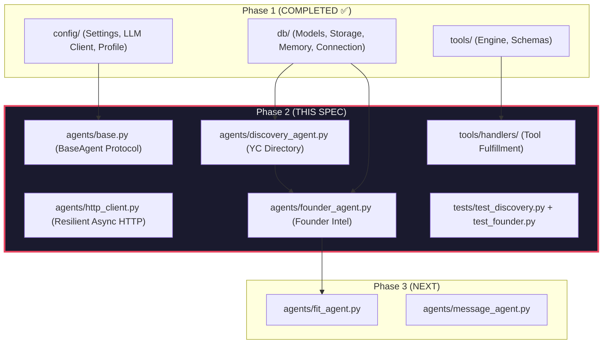
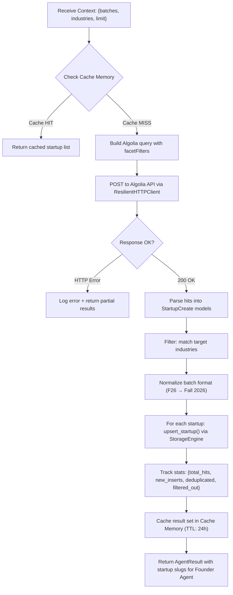
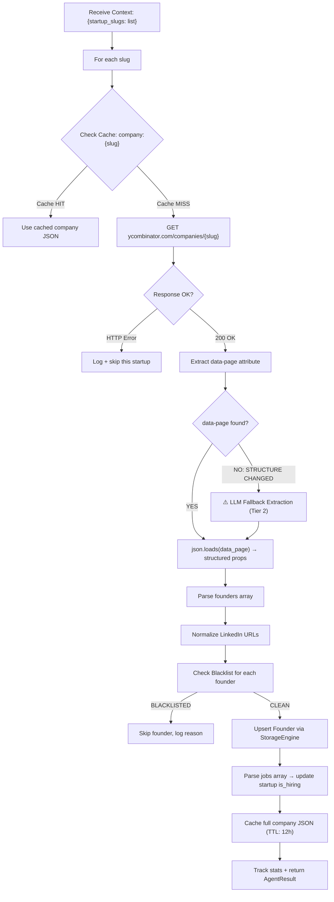

# Phase 2: Data Harvesting & Founder Intelligence Agents

## Purpose

This phase builds the **perception fleet** — the system's eyes and ears. Two autonomous agents discover newly funded YC startups and extract verified founder dossiers, LinkedIn profiles, bios, and active job postings. All data flows into the 4-Tier Memory Engine built in Phase 1.

**Core Design Principles for Phase 2:**

1. **Async-First Architecture**: Both agents use `async/await` with `httpx.AsyncClient` from day one. This avoids a costly sync→async migration in Phase 4 when the Master Orchestrator adds bounded parallelism (`asyncio.Semaphore`).
2. **Zero DOM Scraping**: YC exposes structured data through its Algolia search API and Inertia.js `data-page` JSON payloads. We extract from these structured sources directly — no fragile CSS selectors, no Selenium, no Playwright.
3. **Resilient Extraction with LLM Fallback**: If structured extraction fails (e.g., YC changes their page structure), the system degrades gracefully to LLM-assisted HTML parsing via Tier 2 Extraction models before raising a hard error.
4. **Memory-Aware Deduplication**: Every startup and founder passes through storage deduplication (`ON CONFLICT` upserts) and cache checks before network calls are made. Zero redundant HTTP requests.
5. **Shared HTTP Client with Rate Governance**: A centralized `httpx.AsyncClient` with configurable connection pooling, inter-request delays, and timeout policies — separate from the LLM client's own backoff.

---

## Architecture Context: Where Phase 2 Fits



---

## Spec 2.0: Agent Foundation Layer (`agents/`)

> **🔵 RECOMMENDATION**: Establish a thin `BaseAgent` protocol and shared HTTP client *before* building the two specialist agents. This prevents duplicated boilerplate across Phase 2, 3, and 4 agents.

### 1. Base Agent Protocol (`agents/base.py`)

All agents in the system share a common contract:

```python
class BaseAgent(ABC):
    """Abstract protocol that every specialist agent must implement."""

    agent_name: str           # Unique identifier (e.g., "discovery", "founder")
    description: str          # Human-readable purpose
    required_tools: list[str] # Tool schema names this agent depends on

    @abstractmethod
    async def execute(self, context: dict) -> AgentResult:
        """Main entry point. Receives pipeline context, returns structured result."""
        ...
```

**`AgentResult` contract** (returned by every agent):

```python
@dataclass
class AgentResult:
    success: bool
    agent_name: str
    data: Any                    # Payload (list of startups, list of founders, etc.)
    errors: list[str]            # Non-fatal warnings/issues encountered
    stats: dict[str, int]        # Execution metrics (e.g., {"discovered": 15, "deduplicated": 3, "cached": 7})
    duration_seconds: float      # Wall-clock execution time
```

**Why this matters:**

- The Master Orchestrator (Phase 4) dispatches to agents through a uniform interface — it doesn't need to know *how* each agent works internally.
- Stats tracking enables the dashboard (Phase 5) to show per-agent performance metrics.
- The `errors` list captures non-fatal issues (e.g., "Founder X had no LinkedIn URL") without crashing the pipeline.

---

### 2. Resilient Async HTTP Client (`agents/http_client.py`)

> **🔵 RECOMMENDATION**: Separate the HTTP rate limiter from the LLM fallback engine. Web scraping and API calls have different rate characteristics than LLM completions.

A centralized HTTP client shared by all data harvesting agents:

```python
class ResilientHTTPClient:
    """Async HTTP client with connection pooling, rate limiting, and retry logic."""

    def __init__(
        self,
        max_connections: int = 10,        # Connection pool ceiling
        inter_request_delay: float = 0.5, # Politeness delay between requests (seconds)
        timeout: float = 15.0,            # Per-request timeout (seconds)
        max_retries: int = 3,             # Retry count per URL
        retry_backoff_base: float = 1.0,  # Exponential backoff base
        user_agent: str = "YCOutreachBot/1.0 (research; non-commercial)"
    ):
        ...

    async def get(self, url: str, headers: dict = None, params: dict = None) -> HTTPResult:
        """GET request with retry logic, backoff, and politeness delay."""
        ...

    async def post(self, url: str, json: dict = None, headers: dict = None) -> HTTPResult:
        """POST request with retry logic (used for Algolia API)."""
        ...

    async def close(self):
        """Graceful client shutdown."""
        ...
```

**`HTTPResult` contract:**

```python
@dataclass
class HTTPResult:
    success: bool
    status_code: int
    data: Any                  # Parsed JSON or raw text
    url: str
    attempts: int              # How many tries it took
    error: str | None = None   # Error message if failed
```

**Key behaviors:**

- **Politeness delay**: Configurable `inter_request_delay` between consecutive requests to the same host. Prevents YC from rate-limiting or blocking us.
- **Exponential backoff**: On HTTP 429/503, backs off with `base * 2^retry + jitter` before retrying.
- **Connection pooling**: `httpx.AsyncClient(limits=httpx.Limits(max_connections=10))` prevents socket exhaustion when crawling many company pages.
- **Timeout discipline**: Hard 15-second timeout per request. Network-stalled pages don't block the entire pipeline.
- **Respectful User-Agent**: Identifies the client clearly as a research tool.

**Configuration in `config/settings.py`** (additions):

```python
# HTTP Client Configuration (Phase 2)
http_max_connections: int = Field(default=10, ge=1)
http_inter_request_delay: float = Field(default=0.5, ge=0.0)
http_timeout_seconds: float = Field(default=15.0, ge=1.0)
http_max_retries: int = Field(default=3, ge=1)
algolia_app_id: str = Field(default="45bwzj1sgc", description="YC Algolia Application ID")
algolia_api_key: str = Field(default="Zjk9gs3pOF3ek4OjFbMGitSfRJlfGixw", description="YC Algolia public search-only key")
yc_base_url: str = Field(default="https://www.ycombinator.com", description="YC website base URL")
```

---

## Spec 2.1: YC Startup Discovery Agent (`agents/discovery_agent.py`)

### Objective

Autonomously discover newly funded YC startups from targeted batches, filter by relevant industries, deduplicate against Business Memory, and stage clean `Startup` records.

### Data Source: YC Algolia Public API

YC's public company directory is powered by Algolia search. The API is publicly accessible with read-only credentials embedded in their frontend JavaScript:

```text
Endpoint: https://45bwzj1sgc-dsn.algolia.net/1/indexes/YCCompany_production/query
Method: POST
Headers:
    X-Algolia-Application-Id: 45bwzj1sgc
    X-Algolia-API-Key: Zjk9gs3pOF3ek4OjFbMGitSfRJlfGixw
    Content-Type: application/json
```

**Request body structure:**

```json
{
    "query": "",
    "facetFilters": [["batch:Fall 2026"]],
    "hitsPerPage": 50,
    "page": 0,
    "attributesToRetrieve": [
        "name", "slug", "website", "one_liner", "long_description",
        "team_size", "batch", "tags", "industries", "subindustry",
        "status", "isHiring", "objectID", "small_logo_thumb_url"
    ]
}
```

**Response structure (per hit):**

```json
{
    "name": "Kailash Labs",
    "slug": "kailash-labs",
    "website": "https://kailashlabs.com",
    "one_liner": "A factory for small and specialized video reasoning models",
    "long_description": "...",
    "team_size": 3,
    "batch": "F26",
    "tags": ["Developer Tools", "AI"],
    "industries": ["B2B"],
    "subindustry": "AI/ML",
    "status": "Active",
    "isHiring": true
}
```

### Agent Execution Flow



### Detailed Logic

#### 1. Batch Normalization Map

YC uses short codes in Algolia but human-readable names in the UI. The agent maps both ways:

```python
BATCH_NORMALIZATION = {
    "F26": "Fall 2026",   "Fall 2026": "F26",
    "S26": "Summer 2026", "Summer 2026": "S26",
    "W26": "Winter 2026", "Winter 2026": "W26",
    "F25": "Fall 2025",   "Fall 2025": "F25",
    "S25": "Summer 2025", "Summer 2025": "S25",
    "W25": "Winter 2025", "Winter 2025": "W25",
}
```

The agent accepts either format from the caller and normalizes to whichever Algolia expects.

#### 2. Industry Filtering Logic

After retrieving raw hits from Algolia, the agent applies a **relevance filter** against the configured `default_industries` from settings:

```python
def is_relevant_startup(hit: dict, target_industries: list[str]) -> bool:
    """Returns True if the startup overlaps with at least one target industry."""
    startup_tags = set(t.lower() for t in hit.get("tags", []))
    startup_industries = set(i.lower() for i in hit.get("industries", []))
    all_labels = startup_tags | startup_industries
    if hit.get("subindustry"):
        all_labels.add(hit["subindustry"].lower())
    target_set = set(t.lower() for t in target_industries)
    return bool(all_labels & target_set)
```

> **🔵 RECOMMENDATION**: The filter should be *inclusive by default* — if `target_industries` is empty or not provided, skip filtering entirely and return all hits. This lets the user run broad discovery scans when exploring new domains.

#### 3. Pagination Support

Algolia caps responses at `hitsPerPage` (max 1000, default 50). If the batch has more startups than the limit, the agent paginates:

```python
total_pages = math.ceil(total_hits / hits_per_page)
for page in range(total_pages):
    # Fetch page with politeness delay between requests
    ...
```

#### 4. Cache-First Strategy

Before hitting Algolia, the agent checks Cache Memory:

```python
cache_key_params = {"batches": sorted(batches), "industries": sorted(industries), "limit": limit}
cached = memory_manager.get_cached_tool_result("search_yc_directory", cache_key_params)
if cached:
    return AgentResult(success=True, data=cached, stats={"cached": True}, ...)
```

Cache TTL: **24 hours** (YC doesn't update their directory more than once per day).

#### 5. Deduplication via StorageEngine

Each startup is upserted by slug. The `ON CONFLICT(slug) DO UPDATE` clause in `storage.py` ensures:

- New startups are inserted.
- Existing startups get their metadata refreshed (e.g., `is_hiring` status may change).
- The returned `startup_id` is always valid for foreign key linking.

### Tool Handler Registration

The agent registers fulfillment handlers for the existing tool schemas:

| Tool Schema              | Handler Function                                  | Description                                                   |
| ------------------------ | ------------------------------------------------- | ------------------------------------------------------------- |
| `search_yc_directory`  | `DiscoveryAgent._handle_search_yc_directory()`  | Queries Algolia with filters, returns structured startup list |
| `fetch_batch_startups` | `DiscoveryAgent._handle_fetch_batch_startups()` | Fetches full roster for a specific batch code                 |

These handlers are registered with `tool_engine.register_handler()` during agent initialization.

### Output Contract

The Discovery Agent returns an `AgentResult` containing:

```python
{
    "success": True,
    "agent_name": "discovery",
    "data": [
        {
            "startup_id": 1,        # Database ID after upsert
            "slug": "kailash-labs",
            "name": "Kailash Labs",
            "batch": "Fall 2026",
            "is_hiring": True,
            "industry": "B2B",
            "tags": ["Developer Tools", "AI"]
        },
        # ... more startups
    ],
    "errors": [],
    "stats": {
        "total_algolia_hits": 142,
        "passed_industry_filter": 38,
        "new_startups_inserted": 24,
        "existing_startups_updated": 14,
        "cached_hits": 0
    },
    "duration_seconds": 3.2
}
```

---

## Spec 2.2: Founder Intel & Social Extraction Agent (`agents/founder_agent.py`)

### Objective

For each discovered startup, extract verified founder profiles — names, titles, bios, LinkedIn URLs, Twitter/X handles, and active job postings — from YC's structured Inertia.js data payloads.

### Data Source: YC Inertia.js `data-page` JSON

Every YC company page at `https://www.ycombinator.com/companies/{slug}` uses [Inertia.js](https://inertiajs.com/) for client-side rendering. The server embeds a complete JSON payload inside a `<div id="app" data-page='...'>` attribute in the raw HTML. This JSON contains **100% structured data** — no DOM parsing required.

**HTML structure:**

```html
<div id="app" data-page='{
    "component": "Company",
    "props": {
        "company": {
            "name": "Kailash Labs",
            "slug": "kailash-labs",
            "one_liner": "...",
            "long_description": "...",
            "website": "https://kailashlabs.com",
            "batch_name": "Fall 2026",
            "team_size": 3,
            "tags": [...],
            "founders": [
                {
                    "full_name": "Jane Smith",
                    "title": "CEO & Co-Founder",
                    "bio": "Previously ML engineer at Google Brain...",
                    "linkedin_url": "https://linkedin.com/in/janesmith",
                    "twitter_url": "https://x.com/janesmith",
                    "avatar_thumb": "..."
                }
            ],
            "jobs": [
                {
                    "title": "Founding Engineer",
                    "description": "...",
                    "location": "San Francisco",
                    "remote": true,
                    "url": "https://www.ycombinator.com/companies/kailash-labs/jobs/..."
                }
            ]
        }
    }
}'></div>
```

### Agent Execution Flow



### Detailed Logic

#### 1. Inertia.js JSON Extraction (Primary Path)

```python
import re, json

async def extract_inertia_data(html: str) -> dict | None:
    """Extracts the Inertia.js data-page JSON from raw HTML."""
    # Pattern matches the data-page attribute value
    pattern = r'<div\s+id="app"\s+data-page=[\'"]({.*?})[\'"]\s*>'
    match = re.search(pattern, html, re.DOTALL)
    if match:
        try:
            return json.loads(match.group(1))
        except json.JSONDecodeError:
            # HTML-encoded JSON — try unescaping first
            import html as html_module
            unescaped = html_module.unescape(match.group(1))
            return json.loads(unescaped)
    return None
```

> **🔵 RECOMMENDATION**: The regex should also handle the case where the JSON is HTML-entity-encoded (e.g., `&quot;` instead of `"`). YC has historically served both raw and entity-encoded payloads depending on the rendering path.

#### 2. LLM Fallback Extraction (Degraded Path)

If `extract_inertia_data()` returns `None` (YC changed their page structure), the agent invokes Tier 2 Extraction models to parse the HTML:

```python
async def llm_fallback_extraction(html: str, slug: str) -> dict | None:
    """Uses LLM to extract structured data from raw HTML when Inertia.js extraction fails."""
    # Truncate HTML to first 8000 chars to stay within token limits
    truncated_html = html[:8000]

    messages = [
        {
            "role": "system",
            "content": (
                "You are a structured data extraction engine. Extract company and founder "
                "information from the provided YC company page HTML. Return valid JSON only."
            )
        },
        {
            "role": "user",
            "content": f"Extract founders (name, title, bio, linkedin_url), company description, "
                       f"and job listings from this YC page for '{slug}':\n\n{truncated_html}"
        }
    ]

    response = await asyncio.to_thread(
        llm_client.call_with_fallback,
        tier=ModelTier.EXTRACTION,
        messages=messages,
        response_format={"type": "json_object"},
        temperature=0.0,
        max_tokens=2048,
    )
    # Parse and validate the LLM output
    ...
```

> **🔵 IMPORTANT**: The LLM fallback is a **last resort**. It logs a `WARNING` level alert every time it activates, signaling that the primary extraction path needs human investigation. The system should still work, but with degraded confidence.

**Fallback decision tree:**

```text
1. Try regex extraction of data-page attribute    → SUCCESS? Use it.
2. Try alternative regex patterns (single quotes,  → SUCCESS? Use it.
   different div IDs, Next.js __NEXT_DATA__)
3. Invoke Tier 2 LLM extraction                   → SUCCESS? Use it (with WARNING log).
4. All paths failed                                → Log ERROR, skip this startup,
                                                     add to errors list in AgentResult.
```

#### 3. LinkedIn URL Normalization

Raw LinkedIn URLs from YC often contain tracking parameters or inconsistent formats:

```python
from urllib.parse import urlparse, urlunparse

def normalize_linkedin_url(raw_url: str | None) -> str | None:
    """Standardizes LinkedIn URLs to canonical format."""
    if not raw_url:
        return None

    url = raw_url.strip()

    # Ensure https scheme
    if not url.startswith("http"):
        url = f"https://{url}"

    parsed = urlparse(url)

    # Validate it's actually a LinkedIn URL
    if "linkedin.com" not in parsed.netloc.lower():
        return None

    # Strip query params and fragments (tracking junk)
    clean = urlunparse((
        "https",
        "www.linkedin.com",
        parsed.path.rstrip("/"),
        "", "", ""
    ))

    return clean
```

**Handles these common variants:**

| Input                                                       | Normalized Output                         |
| ----------------------------------------------------------- | ----------------------------------------- |
| `linkedin.com/in/janesmith`                               | `https://www.linkedin.com/in/janesmith` |
| `https://linkedin.com/in/janesmith/`                      | `https://www.linkedin.com/in/janesmith` |
| `https://www.linkedin.com/in/janesmith?trk=some-tracking` | `https://www.linkedin.com/in/janesmith` |
| `http://linkedin.com/in/janesmith`                        | `https://www.linkedin.com/in/janesmith` |
| `not-a-linkedin-url.com`                                  | `None`                                  |

#### 4. Blacklist Pre-Check

Before upserting any founder, the agent runs the Memory Verification check:

```python
is_blocked = storage_engine.is_blacklisted(
    founder_name=founder_data.get("full_name"),
    linkedin_url=normalized_linkedin,
    company_name=startup_name,
    domain=extract_domain(startup_website)
)
if is_blocked:
    logger.info(f"⛔ Skipping blacklisted entity: {founder_data['full_name']} at {startup_name}")
    stats["blacklisted_skips"] += 1
    continue
```

This is the **Input Guardrail** — it fires before any LLM tokens are consumed downstream.

#### 5. Job Posting Extraction

The agent also extracts active job postings to:

- Update the startup's `is_hiring` flag.
- Store job metadata for the Fit Agent (Phase 3) to evaluate role alignment.

> **🔵 RECOMMENDATION**: Add a `jobs` table or store job data as JSONB in the `startups` table. The Fit Agent needs to know *what roles* a startup is hiring for, not just *whether* they're hiring. For now, store as JSONB in a new `jobs_data` column on `startups` to avoid a schema migration. We can normalize later.

**Proposed addition to `StartupCreate` model:**

```python
class StartupCreate(BaseModel):
    # ... existing fields ...
    jobs_data: list[dict] = Field(default_factory=list)  # Raw job postings from YC
```

**Proposed addition to `startups` table:**

```sql
ALTER TABLE startups ADD COLUMN IF NOT EXISTS jobs_data TEXT DEFAULT '[]';
```

### Tool Handler Registration

| Tool Schema                 | Handler Function                                   | Description                                                                          |
| --------------------------- | -------------------------------------------------- | ------------------------------------------------------------------------------------ |
| `extract_company_profile` | `FounderAgent._handle_extract_company_profile()` | Fetches YC page, extracts Inertia.js JSON, returns structured company + founder data |
| `verify_founder_socials`  | `FounderAgent._handle_verify_founder_socials()`  | Normalizes LinkedIn URL, validates against company context                           |

### Output Contract

The Founder Agent returns an `AgentResult` containing:

```python
{
    "success": True,
    "agent_name": "founder",
    "data": [
        {
            "startup_id": 1,
            "startup_slug": "kailash-labs",
            "founders": [
                {
                    "founder_id": 1,
                    "full_name": "Jane Smith",
                    "title": "CEO & Co-Founder",
                    "bio": "Previously ML engineer at Google Brain...",
                    "linkedin_url": "https://www.linkedin.com/in/janesmith",
                    "twitter_url": "https://x.com/janesmith"
                }
            ],
            "jobs": [
                {"title": "Founding Engineer", "location": "SF", "remote": true}
            ]
        }
    ],
    "errors": ["Startup xyz-corp: Inertia.js extraction failed, used LLM fallback"],
    "stats": {
        "startups_processed": 38,
        "founders_extracted": 64,
        "founders_new": 52,
        "founders_updated": 12,
        "blacklisted_skips": 3,
        "linkedin_urls_found": 58,
        "llm_fallback_invocations": 1,
        "extraction_failures": 0
    },
    "duration_seconds": 28.7
}
```

---

## Spec 2.3: Tool Handler Wiring (`tools/handlers/`)

Phase 1 created the tool schemas and the `ToolEngine` dispatcher, but no handlers were registered. Phase 2 wires up the fulfillment layer:

### New Directory Structure

```text
tools/
├── __init__.py
├── engine.py                          # (Phase 1 — modified for async support)
├── schemas/                           # (Phase 1 — no changes)
│   ├── discovery_tools.json
│   ├── founder_tools.json
│   ├── fit_tools.json
│   └── outreach_tools.json
└── handlers/                          # NEW: Phase 2 fulfillment functions
    ├── __init__.py
    ├── discovery_handlers.py          # Handlers for search_yc_directory, fetch_batch_startups
    └── founder_handlers.py            # Handlers for extract_company_profile, verify_founder_socials
```

**Handler registration pattern:**

```python
# tools/handlers/discovery_handlers.py

from tools.engine import tool_engine

async def handle_search_yc_directory(batch: str, industry: str = None,
                                      is_hiring: bool = None, limit: int = 20) -> dict:
    """Fulfillment handler for the search_yc_directory tool."""
    agent = DiscoveryAgent()
    result = await agent.execute({
        "batches": [batch],
        "industries": [industry] if industry else [],
        "limit": limit,
        "is_hiring_filter": is_hiring,
    })
    return result.data

# Register at import time
tool_engine.register_handler("search_yc_directory", handle_search_yc_directory)
tool_engine.register_handler("fetch_batch_startups", handle_fetch_batch_startups)
```

> **🔵 RECOMMENDATION**: Since the tool engine currently calls handlers synchronously (`handler(**arguments)`), we need to update `engine.py` to support async handlers. Add an `async_execute()` method alongside the existing `execute()`, or make `execute()` detect coroutines:
>
> ```python
> import asyncio, inspect
>
> def execute(self, tool_name, arguments=None):
>     handler = self._handlers.get(tool_name)
>     if inspect.iscoroutinefunction(handler):
>         return asyncio.run(handler(**(arguments or {})))
>     return handler(**(arguments or {}))
> ```

---

## Files to Create in Phase 2

```text
agents/                                        # NEW: Agent fleet directory
├── __init__.py                               # Package exports
├── base.py                                   # BaseAgent ABC + AgentResult dataclass
├── http_client.py                            # ResilientHTTPClient (async httpx wrapper)
├── discovery_agent.py                        # YC Startup Discovery Agent (Spec 2.1)
└── founder_agent.py                          # Founder Intel & Social Extraction Agent (Spec 2.2)

tools/
└── handlers/                                  # NEW: Tool fulfillment layer
    ├── __init__.py                            # Handler auto-registration
    ├── discovery_handlers.py                  # search_yc_directory, fetch_batch_startups
    └── founder_handlers.py                    # extract_company_profile, verify_founder_socials

tests/
├── test_discovery.py                          # Discovery agent unit tests (mocked Algolia)
├── test_founder.py                            # Founder agent unit tests (mocked YC pages)
├── test_http_client.py                        # HTTP client resilience tests
└── fixtures/                                  # NEW: Test fixture data
    ├── mock_algolia_response.json             # Simulated Algolia API response
    └── mock_yc_company_page.html              # Simulated YC company page with data-page attribute
```

### Modifications to Existing Phase 1 Files

| File                   | Change                                                                                                                                                                | Reason                                                                   |
| ---------------------- | --------------------------------------------------------------------------------------------------------------------------------------------------------------------- | ------------------------------------------------------------------------ |
| `config/settings.py` | Add HTTP client settings (`http_max_connections`, `http_inter_request_delay`, `http_timeout_seconds`, `algolia_app_id`, `algolia_api_key`, `yc_base_url`) | Phase 2 agents need configurable HTTP parameters                         |
| `db/models.py`       | Add`jobs_data: list[dict]` field to `StartupCreate`                                                                                                               | Store extracted job postings for Phase 3 Fit Agent                       |
| `db/storage.py`      | Add`jobs_data` column to `startups` table DDL; add `get_startups_without_founders()` query                                                                      | Founder Agent needs to know which startups still need founder extraction |
| `tools/engine.py`    | Add async-aware execution support in`execute()`                                                                                                                     | Phase 2 handlers are async coroutines                                    |
| `requirements.txt`   | Add`httpx>=0.27.0`                                                                                                                                                  | Async HTTP client for data harvesting                                    |

---

## Dependencies (Additions to `requirements.txt`)

```text
httpx>=0.27.0                  # Async HTTP client with connection pooling
```

All other dependencies (`openai`, `pydantic`, `pydantic-settings`, `redis`, `pytest`) are already installed from Phase 1.

---

## Verification Criteria & Tests

### Test 1: Discovery Agent — Algolia Integration (`tests/test_discovery.py`)

**Zero live API calls.** All HTTP responses are mocked with fixtures.

| Test Case                                   | What It Verifies                                                                                                                                                |
| ------------------------------------------- | --------------------------------------------------------------------------------------------------------------------------------------------------------------- |
| `test_discovery_parses_algolia_response`  | Mocked Algolia response with 5 hits is correctly parsed into`StartupCreate` models. All fields (name, slug, batch, tags, is_hiring) map correctly.            |
| `test_discovery_filters_by_industry`      | Given 10 hits spanning AI, Biotech, and Fintech, applying industry filter`["AI/ML", "Developer Tools"]` returns only the 4 matching startups.                 |
| `test_discovery_deduplicates_via_storage` | Inserting the same startup slug twice results in 1 row in the database (upsert), not a duplicate. The`stats["existing_startups_updated"]` counter increments. |
| `test_discovery_respects_cache`           | First call hits Algolia (mocked). Second call with identical parameters returns cached result without HTTP call. Cache TTL is verified at 24h.                  |
| `test_discovery_batch_normalization`      | Input`"F26"` is normalized to Algolia's expected `"Fall 2026"` format. Input `"Fall 2026"` also works.                                                    |
| `test_discovery_handles_algolia_error`    | Mocked HTTP 503 from Algolia triggers retry with backoff. After`max_retries` exhausted, agent returns `AgentResult(success=False)` with error description.  |
| `test_discovery_pagination`               | Mocked response with`nbHits: 120` and `hitsPerPage: 50` triggers 3 paginated requests. All 120 results are collected.                                       |

### Test 2: Founder Agent — Inertia.js Extraction (`tests/test_founder.py`)

| Test Case                                          | What It Verifies                                                                                                                                                             |
| -------------------------------------------------- | ---------------------------------------------------------------------------------------------------------------------------------------------------------------------------- |
| `test_founder_extracts_inertia_json`             | Given a mock HTML page with`data-page` attribute containing 2 founders, extracts both founders with correct names, titles, bios, and LinkedIn URLs.                        |
| `test_founder_handles_html_encoded_json`         | Inertia.js JSON with HTML entities (`&quot;`, `&amp;`) is correctly unescaped and parsed.                                                                                |
| `test_founder_normalizes_linkedin_urls`          | Various LinkedIn URL formats (with/without`www`, with tracking params, with trailing slash, with `http`) are all normalized to `https://www.linkedin.com/in/{handle}`. |
| `test_founder_rejects_non_linkedin_urls`         | A URL like`https://github.com/janesmith` passed as `linkedin_url` returns `None` after normalization.                                                                  |
| `test_founder_skips_blacklisted_entities`        | A founder whose name is in the blacklist is skipped. The`stats["blacklisted_skips"]` counter increments. Zero LLM tokens consumed.                                         |
| `test_founder_llm_fallback_on_missing_data_page` | Given HTML without a`data-page` attribute, the agent invokes the LLM fallback (mocked) and successfully extracts founder data. A WARNING log is emitted.                   |
| `test_founder_links_to_correct_startup`          | Extracted founders are upserted with the correct`startup_id` foreign key.                                                                                                  |
| `test_founder_extracts_jobs`                     | Job postings from the Inertia.js payload are parsed and stored as`jobs_data` on the startup record.                                                                        |
| `test_founder_caches_company_page`               | First extraction hits YC (mocked). Second call for the same slug uses cached data.                                                                                           |

### Test 3: HTTP Client Resilience (`tests/test_http_client.py`)

| Test Case                               | What It Verifies                                                                    |
| --------------------------------------- | ----------------------------------------------------------------------------------- |
| `test_http_retries_on_429`            | Mocked 429 response triggers exponential backoff retry. Succeeds on second attempt. |
| `test_http_respects_politeness_delay` | Two consecutive requests have at least`inter_request_delay` seconds between them. |

### Running All Phase 2 Tests

```bash
cd "c:\Movie\Y Cominator(Agents)"
.venv\Scripts\python -m pytest tests/test_discovery.py tests/test_founder.py tests/test_http_client.py -v --tb=short
```

**Expected result: All tests pass with zero live API calls and zero LLM token consumption.**

---

## End-to-End Data Flow Summary

```text
┌─────────────────────────────────────────────────────────────────────────────────────┐
│                           PHASE 2 DATA FLOW                                         │
│                                                                                     │
│  CLI / Orchestrator                                                                 │
│       │                                                                             │
│       ▼                                                                             │
│  DiscoveryAgent.execute(batches=["Fall 2026"], industries=["AI/ML", "B2B"])         │
│       │                                                                             │
│       ├── Cache check (Redis) ─────────────────── HIT? → Return cached data         │
│       │                                                                             │
│       ├── POST Algolia API ──────── Parse hits ── Filter industries ── Paginate     │
│       │                                                                             │
│       ├── For each startup: storage_engine.upsert_startup() ── Dedup by slug        │
│       │                                                                             │
│       ├── Cache result (TTL: 24h)                                                   │
│       │                                                                             │
│       └── Return: AgentResult { startup_slugs: [...] }                              │
│               │                                                                     │
│               ▼                                                                     │
│  FounderAgent.execute(startup_slugs=["kailash-labs", "acme-ai", ...])               │
│       │                                                                             │
│       ├── For each slug:                                                            │
│       │       ├── Cache check (Redis) ─────────── HIT? → Use cached HTML            │
│       │       │                                                                     │
│       │       ├── GET ycombinator.com/companies/{slug}                              │
│       │       │                                                                     │
│       │       ├── Extract data-page JSON ──── FAIL? → LLM Fallback (Tier 2)         │
│       │       │                                                                     │
│       │       ├── Parse founders[] ── Normalize LinkedIn ── Blacklist check          │
│       │       │                                                                     │
│       │       ├── Upsert each founder (FK → startup_id)                             │
│       │       │                                                                     │
│       │       ├── Parse jobs[] ── Update startup.is_hiring + jobs_data              │
│       │       │                                                                     │
│       │       └── Cache company JSON (TTL: 12h)                                     │
│       │                                                                             │
│       └── Return: AgentResult { founders: [...], jobs: [...], stats: {...} }         │
│               │                                                                     │
│               ▼                                                                     │
│  ── READY FOR PHASE 3: Fit Qualification & Message Generation ──                    │
└─────────────────────────────────────────────────────────────────────────────────────┘
```

---

## Phase 2 → Phase 3 Handoff Contract

Phase 2 completes when Business Memory contains:

- **Startups table**: Populated with YC companies from targeted batches, filtered by industry, with `is_hiring` flags and `jobs_data`.
- **Founders table**: Verified founder records with normalized LinkedIn URLs, linked via foreign keys to their startups.
- **Blacklist enforcement**: Any blacklisted entities were skipped during extraction.

Phase 3 (Fit Qualification & Message Generation) consumes this data by:

1. Querying `startups JOIN founders` for entities that have **no** `fit_evaluations` record yet.
2. Running the Blacklist Gate as an additional pre-check.
3. Dispatching to the Fit Agent and Message Agent.

---

## Open Questions for Review

### 1. Jobs Data Storage Strategy

Should we add a dedicated `jobs` table with proper relational schema now, or store as JSONB on `startups` and normalize later? JSONB is faster to ship but less queryable.

**Recommendation**: Start with JSONB, normalize in Phase 4 if query patterns demand it.

### 2. Algolia API Key Durability

The Algolia credentials are publicly embedded in YC's frontend JS. They rotate occasionally. Should we spec a self-healing mechanism that re-scrapes the key from YC's JS bundle when the current key returns 403? Or is manual update acceptable for V1?

**Recommendation**: Manual update for V1. Add a health-check that detects 403 and logs a clear `ACTION REQUIRED: Algolia API key expired` message.

### 3. Founder Identity Confidence

When multiple founders share similar names across different startups, the current dedup key is `(startup_id, full_name)`. Should we add an optional `founder_hash` (SHA256 of `lowercase(name) + linkedin_url`) for cross-startup identity matching in Implicit Memory?

**Recommendation**: Add the hash column now as optional, populate it when LinkedIn URL is available. Useful for Phase 6 implicit learning.

---

## Next Step

Once you review and approve this Phase 2 spec, we will proceed to implement **Spec 2.0 (Base Agent + HTTP Client)** first, then **Spec 2.1 (Discovery Agent)**, then **Spec 2.2 (Founder Agent)**, with tests after each sub-spec. Waiting for your nod!
