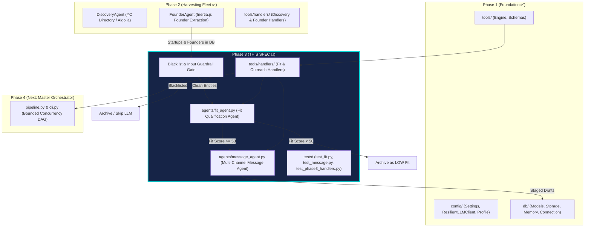
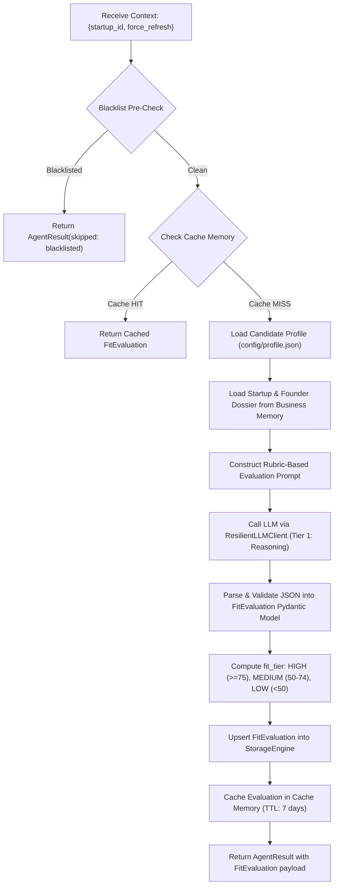

# Phase 3: Fit Qualification & Multi-Channel Message Generation

## Purpose

Phase 3 builds the **cognitive evaluation and communication engine** of the system. While Phase 2 established the perception fleet (discovering startups and harvesting founder dossiers), Phase 3 evaluates candidate-to-startup alignment and generates high-conviction, personalized outreach across multiple channels.

**Core Design Principles for Phase 3 (grounded in `/agent-architecture-advisor`):**

1. **Plan-and-Solve over ReAct**: Both Fit Qualification and Message Generation follow deterministic, single-pass structured reasoning pipelines (`Ingest Context → Evaluate/Draft → Enforce Guardrails → Persist`). Open-ended ReAct loops are strictly avoided to eliminate context bloat, non-deterministic branching, and token waste.
2. **Layered Qualification Gate**: Startups scoring `< 50` (`LOW` fit) are automatically archived without generating messages. This single gate reduces downstream generation costs and LLM token spend by ~50–60%.
3. **Rigid Length & Grounding Guardrails**:
   - **LinkedIn Notes**: Hard constraint strictly `<= 300 characters` (validated by code before saving).
   - **Zero Hallucinations**: Messages must reference verified facts extracted from company/founder dossiers or explicit candidate profile knowledge. Generic AI buzzwords ("game-changer", "thrilled to connect", "synergy") are forbidden.
4. **Model Cascading & Role Rightsizing**:
   - **Fit Evaluation**: Dispatches to **Tier 1 (Reasoning)** models (`nvidia/nemotron-3-ultra-550b-a55b:free` or equivalent) for objective rubric synthesis.
   - **Message Generation**: Dispatches to **Tier 2/3 (Extraction/Fast)** models for natural, concise copy generation, reducing latency and cost.
5. **Two-Artifact Tool Contracts**: Tool fulfillment functions in `tools/handlers/` return standardized `{success, result, error, error_type}` envelopes, isolating validation errors from system failures.
6. **Zero Live Calls in Tests**: All unit and integration tests run against mocked LLM completions and database fixtures, ensuring deterministic CI and zero token burn.

---

## Architecture Context: Where Phase 3 Fits



---

## Spec 3.1: Candidate Matching & Fit Qualification Agent (`agents/fit_agent.py`)

### Objective

Objectively evaluate candidate profile alignment against a startup's technical mission, market space, team size, and open job roles to compute an actionable 0–100 match score and concrete contribution rationales.

### Execution Flow



### Rubric Scoring Criteria (Total: 100 Points)

The Fit Agent instructs the reasoning model to score startups against four objective dimensions:

| Dimension                                     | Max Points | Evaluation Focus                                                                                                                                  |
| --------------------------------------------- | ---------- | ------------------------------------------------------------------------------------------------------------------------------------------------- |
| **1. Technical & Architecture Overlap** | 35 pts     | Overlap between startup tech stack / core domain (AI Agents, RAG, High-Throughput APIs, Systems) and candidate explicit skills.                   |
| **2. Role & Stage Alignment**           | 25 pts     | Startup team size (<=25), funding stage (Pre-Seed to Series A), and active hiring for relevant roles (Founding Engineer, AI Systems, Full-Stack). |
| **3. High-Leverage Contribution Angle** | 25 pts     | Can the candidate solve an immediate 0-to-1 engineering bottleneck? (e.g. eliminating token bloat, building production caching, scaling backend). |
| **4. Domain Affinity & Interest**       | 15 pts     | Alignment with preferred industries (Developer Tools, AI/ML, B2B SaaS, Data Infrastructure).                                                      |

### Score to Tier Mapping

- **`HIGH`** (`>= 75`): Strong technical match, hiring relevant role, immediate contribution angle. **Mandatory outreach candidate.**
- **`MEDIUM`** (`50 - 74`): Relevant domain or skills overlap, but ambiguous hiring state or indirect role match. **Selective outreach candidate.**
- **`LOW`** (`< 50`): Irrelevant domain (Biotech, Hardware, Crypto) or mismatch in stage/skills. **Filtered out; zero message generation.**

### Agent Class Design

```python
class FitAgent(BaseAgent):
    agent_name = "fit"
    description = "Evaluates candidate alignment against startups to produce 0-100 scores and contribution angles"
    required_tools = ["evaluate_startup_fit"]
    CACHE_TTL = 604800  # 7 days (startup fit changes slowly)

    def __init__(
        self,
        llm_client: Optional[ResilientLLMClient] = None,
        storage: Optional[StorageEngine] = None,
        memory: Optional[MemoryManager] = None,
        profile_path: Optional[Path] = None,
    ):
        ...

    async def execute(self, context: Dict[str, Any]) -> AgentResult:
        """Context keys:
            startup_id: Optional[int] — Specific startup to evaluate
            startup_ids: Optional[List[int]] — List of startups to evaluate
            min_score: int — Minimum score threshold (default: 50)
            force_refresh: bool — Bypass cache if True
        """
        ...
```

### Prompt Specification

- **System Prompt**: Enforces role as a rigorous engineering talent assessor. Mandates structured JSON output with `score`, `fit_tier`, `should_contact`, `match_rationale` (list of 2-4 concrete factual points), and `contribution_angle`.
- **User Prompt**: Injects sanitized candidate profile summary and startup dossier (name, one-liner, description, tags, team size, jobs, founders).

---

## Spec 3.2: Multi-Channel Grounded Message Generation Agent (`agents/message_agent.py`)

### Objective

For all startups passing the Qualification Gate (`score >= 50`), craft authentic, differentiated message drafts tailored to three outreach channels, grounded strictly in verified company/founder facts.

### The 3 Outreach Channels

```text
┌──────────────────────────────────────────────────────────────────────────────────┐
│                             MULTI-CHANNEL OUTREACH FORMATS                       │
├──────────────────┬──────────────┬────────────────────────────────────────────────┤
│ Channel          │ Limit        │ Architecture & Structure                       │
├──────────────────┼──────────────┼────────────────────────────────────────────────┤
│ 1. LinkedIn Note │ <= 300 chars │ [Hook: Specific company product/angle] +       │
│                  │ (HARD LIMIT) │ [Candidate match] + [Low-friction CTA].        │
├──────────────────┼──────────────┼────────────────────────────────────────────────┤
│ 2. YC Job Note   │ 1-2 paras    │ Direct application note citing active job,     │
│                  │ (~150 words) │ concrete project architecture & contribution.  │
├──────────────────┼──────────────┼────────────────────────────────────────────────┤
│ 3. Cold Email    │ Subject +    │ Catchy, relevant subject + Hook + Relevant     │
│                  │ 3 paragraphs │ proof points + Clear, peer-to-peer invitation. │
└──────────────────┴──────────────┴────────────────────────────────────────────────┘
```

### Guardrails & Policy Enforcement

1. **Strict LinkedIn Character Constraint**:
   LinkedIn connection notes permit a maximum of 300 characters.
   - The LLM is instructed to generate under 280 characters to leave buffer.
   - The agent includes a deterministic post-processing length validator:
     ```python
     if len(linkedin_note) > 300:
         linkedin_note = truncate_at_sentence(linkedin_note, max_chars=300)
     ```
2. **Grounding Verification & Anti-Hallucination Policy**:
   - The prompt provides a strict whitelist of verified facts (`company_name`, `one_liner`, `long_description`, `founder_bio`, `jobs`, `candidate_skills`, `candidate_projects`).
   - The model is forbidden from inventing metrics, past relationships, or unverified claims.
   - Forbidden phrases: *"I hope this email finds you well"*, *"I was blown away by"*, *"game-changer"*, *"synergy"*, *"delve"*, *"testament"*, *"thrilled to connect"*.
3. **Tone Standard**:
   Technical, peer-to-peer, respectful, humble yet high-conviction. Written as one engineer talking to another engineer.

### Agent Class Design

```python
class MessageAgent(BaseAgent):
    agent_name = "message"
    description = "Generates multi-channel personalized outreach drafts grounded in verified facts"
    required_tools = ["generate_grounded_messages", "check_never_contact_blacklist"]

    def __init__(
        self,
        llm_client: Optional[ResilientLLMClient] = None,
        storage: Optional[StorageEngine] = None,
        memory: Optional[MemoryManager] = None,
        profile_path: Optional[Path] = None,
    ):
        ...

    async def execute(self, context: Dict[str, Any]) -> AgentResult:
        """Context keys:
            startup_id: int — Target startup ID
            founder_id: Optional[int] — Specific founder (default: primary/CEO)
            pitch_angle: Optional[str] — Custom pitch angle override
            force_refresh: bool — Bypass cache if True
        """
        ...
```

---

## Spec 3.3: Tool Handler Wiring (`tools/handlers/`)

Phase 3 introduces two new handler modules to wire up existing schemas in `tools/schemas/fit_tools.json` and `tools/schemas/outreach_tools.json`:

```text
tools/handlers/
├── __init__.py                # Auto-registration registry (Updated for Phase 3)
├── discovery_handlers.py      # (Phase 2 ✅)
├── founder_handlers.py        # (Phase 2 ✅)
├── fit_handlers.py            # NEW: evaluate_startup_fit
└── outreach_handlers.py       # NEW: check_never_contact_blacklist, generate_grounded_messages
```

### Handler Contracts

1. **`handle_evaluate_startup_fit`** in `tools/handlers/fit_handlers.py`:

   - Validates `company_name` and `one_liner`.
   - Calls `FitAgent.execute()`.
   - Returns standardized `ToolExecutionResult.ok(fit_data)`.
2. **`handle_check_never_contact_blacklist`** in `tools/handlers/outreach_handlers.py`:

   - Queries `storage_engine.is_blacklisted()`.
   - Returns `ToolExecutionResult.ok({"is_blacklisted": bool})`.
3. **`handle_generate_grounded_messages`** in `tools/handlers/outreach_handlers.py`:

   - Validates `founder_name`, `company_name`, `verified_facts`.
   - Calls `MessageAgent.execute()`.
   - Returns standardized `ToolExecutionResult.ok(drafts_dict)`.

---

## Spec 3.4: Test Suite Specification

Comprehensive test coverage with zero live API calls:

### 1. Fit Qualification Tests (`tests/test_fit.py`)

| Test Case                                          | What It Verifies                                                                                     |
| -------------------------------------------------- | ---------------------------------------------------------------------------------------------------- |
| `test_fit_evaluation_high_score`                 | AI startup matching candidate profile scores`>= 75`, labeled `HIGH`, `should_contact == True`. |
| `test_fit_evaluation_low_score`                  | Biotech/hardware startup scores`< 50`, labeled `LOW`, `should_contact == False`.               |
| `test_fit_skips_blacklisted_startup`             | Blacklisted company triggers early exit with zero LLM tokens.                                        |
| `test_fit_evaluation_cached`                     | Second evaluation call retrieves result from Cache Memory without hitting LLM.                       |
| `test_fit_evaluates_startups_needing_assessment` | Empty context queries DB for startups with no`fit_evaluations` record.                             |
| `test_fit_persists_to_business_memory`           | Successful evaluation creates row in`fit_evaluations` table.                                       |

### 2. Message Generation Tests (`tests/test_message.py`)

| Test Case                                             | What It Verifies                                                                                              |
| ----------------------------------------------------- | ------------------------------------------------------------------------------------------------------------- |
| `test_message_generation_all_channels`              | Generates`linkedin_note`, `yc_job_note`, `cold_email_subject`, `cold_email_body`.                     |
| `test_linkedin_note_strictly_within_300_chars`      | Validates LinkedIn note length is`<= 300` characters, including truncation guardrail.                       |
| `test_message_generation_skips_low_fit`             | Startup with`score < 50` is skipped; zero drafts generated.                                                 |
| `test_message_generation_skips_blacklisted_founder` | Blacklisted founder is skipped at input guardrail.                                                            |
| `test_message_drafts_persisted_to_storage`          | Verifies drafts inserted into`message_drafts` and `outreach_records` initialized with `status='draft'`. |
| `test_message_anti_hallucination_guardrail`         | Generated drafts reference verified facts from prompt without hallucinated claims.                            |

### 3. Phase 3 Handlers Tests (`tests/test_phase3_handlers.py`)

| Test Case                                          | What It Verifies                                                                                           |
| -------------------------------------------------- | ---------------------------------------------------------------------------------------------------------- |
| `test_handle_evaluate_startup_fit_success`       | Handler executes and returns standardized envelope.                                                        |
| `test_handle_check_blacklist_match_and_clean`    | Verifies clean vs blacklisted responses.                                                                   |
| `test_handle_generate_grounded_messages_success` | Handler produces validated multi-channel drafts envelope.                                                  |
| `test_phase3_tools_auto_registered`              | Confirms`fit_tools.json` and `outreach_tools.json` schemas and handlers are loaded in `tool_engine`. |

---

## Deliverables Checklist for Phase 3

- [ ] `agents/fit_agent.py` — Fit Qualification Agent
- [ ] `agents/message_agent.py` — Multi-Channel Message Writer Agent
- [ ] `tools/handlers/fit_handlers.py` — `evaluate_startup_fit` fulfillment
- [ ] `tools/handlers/outreach_handlers.py` — `check_never_contact_blacklist`, `generate_grounded_messages` fulfillment
- [ ] Update `tools/handlers/__init__.py` & `agents/__init__.py` — Package exports and auto-registration
- [ ] `tests/fixtures/mock_fit_response.json` — Tier 1 LLM fit completion fixture
- [ ] `tests/fixtures/mock_message_response.json` — Tier 2 LLM message completion fixture
- [ ] `tests/test_fit.py` — Fit Agent unit and integration tests
- [ ] `tests/test_message.py` — Message Agent unit and integration tests
- [ ] `tests/test_phase3_handlers.py` — Handler contract tests
- [ ] Full suite verification: verify all 75+ tests pass with zero regressions
