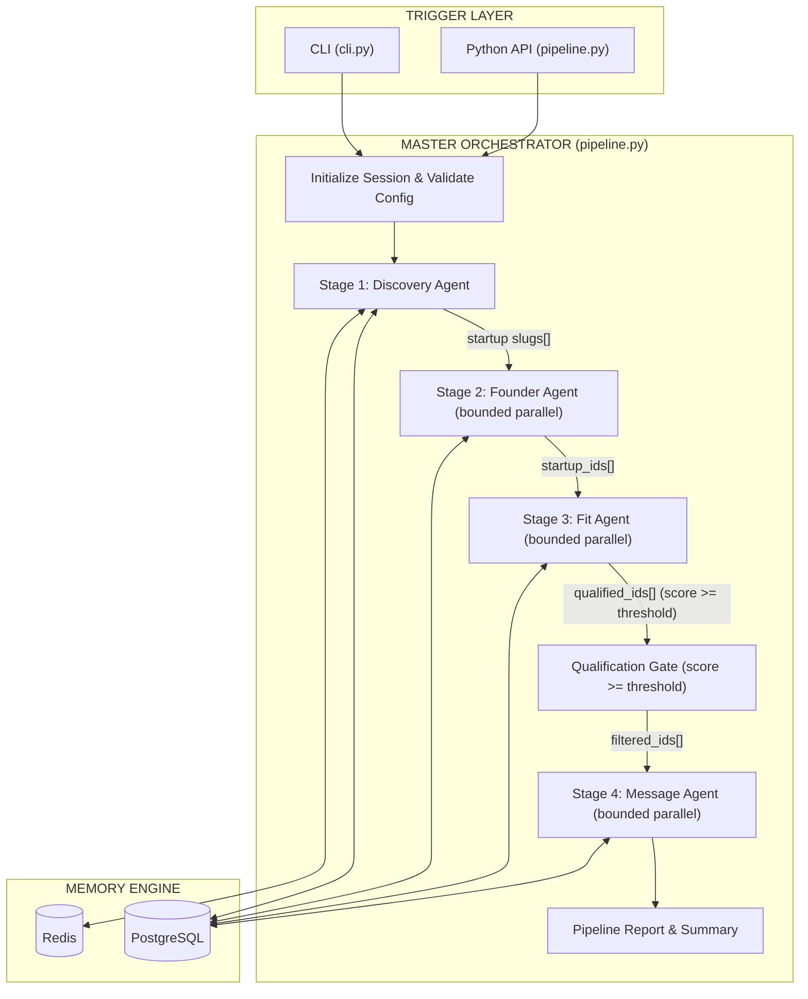
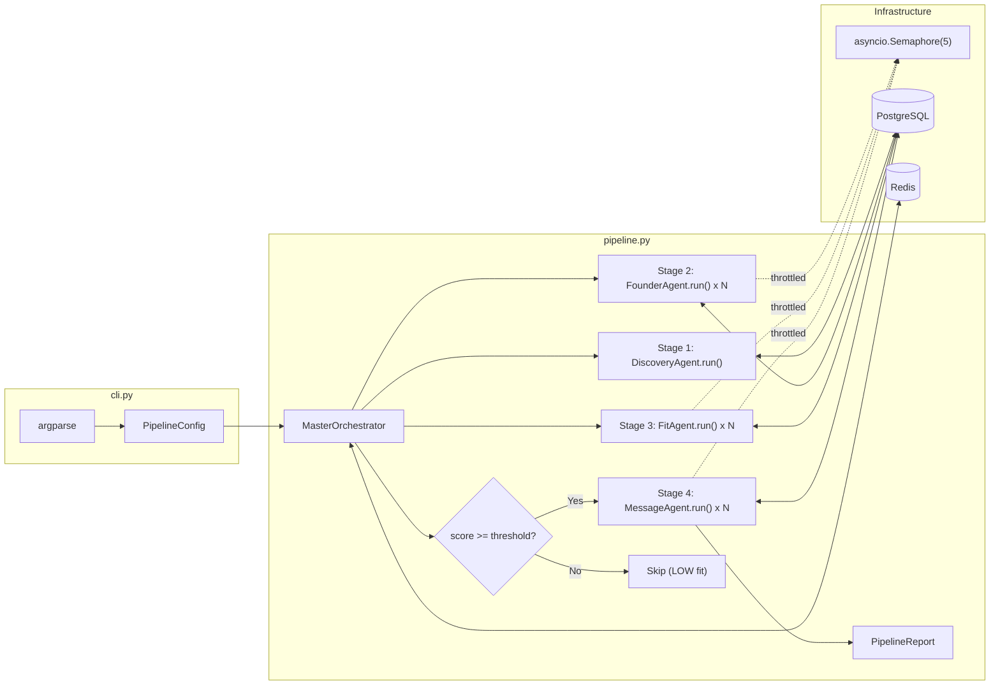

# Phase 4: Master Pipeline Orchestrator & CLI

## Executive Summary

Phase 4 welds the four specialist agents (Discovery → Founder → Fit → Message) into a **single deterministic orchestration pipeline** controlled by a CLI and programmable Python API. The orchestrator is pure code — no LLM tokens are burned on coordination, routing, or state transitions.

> [!IMPORTANT]
> **Architectural Pattern: Plan-and-Solve (Deterministic Executor)**
> Per the agent-architecture-advisor: "Orchestration logic should be code, not tokens wherever the flow is knowable in advance." Our pipeline has a known dependency structure (Discovery must finish before Founder, Founder before Fit, Fit before Message). A deterministic code executor is the correct pattern — NOT a ReAct loop, NOT an LLM router. LLM reasoning is invoked **only** inside specialist agents where cognitive judgment is mandatory.

---

## 1. Architecture Overview

### 1.1 Pipeline DAG (Dependency Graph)



### 1.2 Core Design Decisions

| Decision | Choice | Rationale (agent-architecture-advisor) |
|---|---|---|
| **Orchestration pattern** | Plan-and-Solve (deterministic executor) | Known dependency structure; cost-sensitive (zero tokens on coordination) |
| **Concurrency model** | `asyncio.Semaphore(N)` bounded parallelism | Respects OpenRouter rate limits while maximizing throughput |
| **Error handling** | Deterministic fallbacks in code, not probabilistic LLM recovery | "The code WILL execute the fallback instead of the model MIGHT notice" |
| **State management** | Pipeline context dict passed stage-to-stage; Redis session state | "Session memory != application state" — PostgreSQL is truth, Redis is ephemeral |
| **Progress reporting** | Structured `PipelineReport` Pydantic model | "Contracts, not comments" — typed output enforced at runtime |
| **CLI framework** | `argparse` (stdlib, zero dependencies) | No framework overhead for a straightforward command interface |

---

## 2. File Manifest

### [NEW] Files to Create

| File | Purpose |
|---|---|
| `pipeline.py` | `MasterOrchestrator` class — deterministic DAG executor |
| `cli.py` | Rich CLI entry point with subcommands |
| `tests/test_pipeline.py` | End-to-end pipeline integration tests (all mocked) |
| `tests/fixtures/mock_pipeline_context.json` | Pipeline test fixture data |
| `Specs/phase4_orchestration/spec.md` | This specification (for audit trail) |

### [MODIFY] Files to Update

| File | Change |
|---|---|
| `agents/__init__.py` | Export `MasterOrchestrator` |
| `db/storage.py` | Add `get_startups_needing_founders()` and `get_qualified_startup_ids()` query helpers |
| `config/settings.py` | Add Phase 4 orchestration config fields |

---

## 3. Detailed Component Specifications

### 3.1 `pipeline.py` — Master Pipeline Orchestrator

#### 3.1.1 Pydantic Contracts (Input & Output)

```python
from pydantic import BaseModel, Field
from typing import List, Optional, Dict, Any
from datetime import datetime
from enum import Enum

class PipelineStage(str, Enum):
    DISCOVERY = "discovery"
    FOUNDER = "founder"
    FIT = "fit"
    MESSAGE = "message"

class PipelineConfig(BaseModel):
    """Validated pipeline execution parameters."""
    batches: List[str] = Field(default_factory=lambda: ["Fall 2026", "Summer 2026"])
    industries: List[str] = Field(default_factory=list)
    limit: Optional[int] = Field(default=None, ge=1, le=500,
        description="Max startups to process per batch (None = all)")
    min_fit_score: int = Field(default=50, ge=0, le=100,
        description="Qualification gate threshold")
    max_concurrency: int = Field(default=5, ge=1, le=20,
        description="Bounded parallelism for agent execution")
    skip_stages: List[PipelineStage] = Field(default_factory=list,
        description="Stages to skip (e.g., re-run only messaging)")
    force_refresh: bool = Field(default=False,
        description="Bypass all caches and re-evaluate")
    dry_run: bool = Field(default=False,
        description="Run discovery only, no LLM calls")

class StageResult(BaseModel):
    """Result of a single pipeline stage."""
    stage: PipelineStage
    success: bool
    items_processed: int = 0
    items_succeeded: int = 0
    items_failed: int = 0
    errors: List[str] = Field(default_factory=list)
    duration_seconds: float = 0.0

class PipelineReport(BaseModel):
    """Complete pipeline execution report."""
    session_id: str
    config: PipelineConfig
    stages: Dict[PipelineStage, StageResult] = Field(default_factory=dict)
    total_startups_discovered: int = 0
    total_founders_extracted: int = 0
    total_fit_evaluated: int = 0
    total_qualified: int = 0       # score >= threshold
    total_drafts_generated: int = 0
    total_duration_seconds: float = 0.0
    started_at: datetime
    completed_at: Optional[datetime] = None
    success: bool = False
```

> [!NOTE]
> **Why Pydantic, not dicts:** Per agent-architecture-advisor — "Contracts, not comments: define expected output as a Pydantic model enforced at runtime. Malformed output should raise immediately — no silent failures." Every stage result and the final pipeline report are typed and validated.

#### 3.1.2 Orchestrator Class Design

```python
class MasterOrchestrator:
    """Deterministic DAG executor for the outreach pipeline.

    Runs: Discovery -> Founder -> Fit -> [Qualification Gate] -> Message
    All coordination is pure code. LLM calls happen only inside agents.
    """

    def __init__(
        self,
        config: Optional[PipelineConfig] = None,
        storage: Optional[StorageEngine] = None,
        memory: Optional[MemoryManager] = None,
    ):
        self.config = config or PipelineConfig()
        self.storage = storage or default_storage_engine
        self.memory = memory or default_memory_manager
        self.session_id = self._generate_session_id()
        self._semaphore: Optional[asyncio.Semaphore] = None

    async def run(self) -> PipelineReport:
        """Execute the full pipeline. Returns a typed report."""
        ...

    async def _run_stage_discovery(self, report: PipelineReport) -> List[dict]:
        """Stage 1: Discover startups via Algolia/YC-OSS."""
        ...

    async def _run_stage_founders(
        self, startup_slugs: List[str], report: PipelineReport
    ) -> List[int]:
        """Stage 2: Extract founders with bounded parallelism."""
        ...

    async def _run_stage_fit(
        self, startup_ids: List[int], report: PipelineReport
    ) -> List[int]:
        """Stage 3: Evaluate fit scores with bounded parallelism."""
        ...

    async def _run_stage_messages(
        self, qualified_ids: List[int], report: PipelineReport
    ) -> int:
        """Stage 4: Generate message drafts for qualified startups."""
        ...
```

#### 3.1.3 Concurrency Model

```python
async def _run_parallel(self, coros, stage_name: str) -> List[Any]:
    """Execute coroutines with bounded parallelism via semaphore.

    Uses asyncio.Semaphore to cap concurrent LLM/HTTP calls,
    preventing OpenRouter 429 rate limit storms.
    """
    semaphore = asyncio.Semaphore(self.config.max_concurrency)

    async def throttled(coro):
        async with semaphore:
            return await coro

    results = await asyncio.gather(
        *[throttled(c) for c in coros],
        return_exceptions=True,
    )
    # Separate successes from failures
    successes, failures = [], []
    for r in results:
        if isinstance(r, Exception):
            failures.append(str(r))
        else:
            successes.append(r)
    return successes, failures
```

> [!TIP]
> **Why `asyncio.Semaphore(5)` not `asyncio.gather()` unbounded:** Per agent-architecture-advisor — "Rate limits & reliability: retries (exponential backoff + jitter) for transient failures only; token bucket to self-limit outbound rates." The semaphore acts as a simple token bucket preventing thundering-herd 429 storms. The default `max_concurrency=5` keeps us well within OpenRouter free-tier limits.

#### 3.1.4 Error Containment Strategy

Each stage is **fail-soft**: individual item failures are logged and accumulated in `StageResult.errors` but do **not** abort the pipeline. The pipeline only fails globally if a stage produces zero usable outputs.

```
Discovery fails entirely -> Pipeline aborts (no data to process)
Founder extraction fails for 3/84 startups -> 81 proceed to Fit
Fit evaluation fails for 2/81 -> 79 proceed to Qualification Gate
Qualification Gate filters 79 -> 12 qualified (score >= 50)
Message generation fails for 1/12 -> 11 drafts staged
Pipeline reports: success=True with 11 drafts and 6 non-fatal errors
```

> [!IMPORTANT]
> **Deterministic fallbacks, not probabilistic:** Per agent-architecture-advisor — "Error handling is deterministic (the code WILL execute the fallback) instead of probabilistic (the model MIGHT notice)." Each stage wraps individual items in try/except. The orchestrator never asks an LLM "what went wrong" — it captures the exception, logs it, and continues.

#### 3.1.5 Session State & Progress Tracking

```python
# Redis session keys (ephemeral, cleared after pipeline run)
session:{session_id}:stage        # current stage name
session:{session_id}:progress     # {"processed": 42, "total": 84}
session:{session_id}:started_at   # ISO timestamp
session:{session_id}:config       # serialized PipelineConfig
```

This enables Phase 5's dashboard to poll pipeline progress in real-time via a simple Redis read.

---

### 3.2 `cli.py` — Command-Line Interface

#### 3.2.1 Subcommand Architecture

```
python cli.py run [OPTIONS]        # Execute the full pipeline
python cli.py stats                # Show database summary
python cli.py blacklist [OPTIONS]  # Manage the never-contact list
python cli.py export [OPTIONS]     # Export leads to CSV/JSON
```

#### 3.2.2 `run` Subcommand

```bash
python cli.py run \
    --batch "Fall 2026" "Summer 2026" \
    --industry "AI/ML" "Developer Tools" \
    --limit 20 \
    --min-score 75 \
    --concurrency 3 \
    --skip founder \
    --force-refresh \
    --dry-run
```

| Flag | Type | Default | Description |
|---|---|---|---|
| `--batch` | str (multiple) | settings.default_batches | YC batch names (long format) |
| `--industry` | str (multiple) | `[]` (all) | Filter by industry tags |
| `--limit` | int | None (all) | Max startups per batch |
| `--min-score` | int | 50 | Qualification gate threshold |
| `--concurrency` | int | 5 | Max parallel agent executions |
| `--skip` | str (multiple) | `[]` | Stages to skip |
| `--force-refresh` | flag | False | Bypass caches |
| `--dry-run` | flag | False | Discovery only, no LLM calls |
| `--verbose` | flag | False | Enable DEBUG-level logging |

#### 3.2.3 `stats` Subcommand

```bash
python cli.py stats
```

Output:
```
+==============================================================+
|  YC FOUNDER OUTREACH -- DATABASE SUMMARY                     |
+==============================================================+
|  Startups Discovered  : 248                                  |
|  Founders Extracted   : 412                                  |
|  Fit Evaluations      : 186                                  |
|    -> HIGH (>=75)     :  24                                  |
|    -> MEDIUM (50-74)  :  38                                  |
|    -> LOW (<50)       : 124                                  |
|  Message Drafts       :  62                                  |
|  Outreach Status:                                            |
|    -> draft           :  34                                  |
|    -> approved        :  12                                  |
|    -> sent            :  14                                  |
|    -> replied         :   2                                  |
|  Blacklisted Entities :   7                                  |
+==============================================================+
```

#### 3.2.4 `blacklist` Subcommand

```bash
# Add to blacklist
python cli.py blacklist add --type company_name --value "SpamCorp" --reason "Unresponsive"
python cli.py blacklist add --type founder_name --value "John Doe" --reason "Declined"

# List blacklisted entities
python cli.py blacklist list

# Remove from blacklist
python cli.py blacklist remove --value "SpamCorp"
```

#### 3.2.5 `export` Subcommand

```bash
# Export qualified leads with drafts
python cli.py export --min-score 50 --format csv --output leads.csv
python cli.py export --min-score 75 --format json --output high_leads.json
```

---

### 3.3 `config/settings.py` — New Configuration Fields

```python
# Phase 4: Pipeline Orchestration
pipeline_max_concurrency: int = Field(default=5, ge=1, le=20,
    description="Default bounded parallelism for pipeline stages")
pipeline_default_min_score: int = Field(default=50, ge=0, le=100,
    description="Default qualification gate threshold")
pipeline_session_ttl: int = Field(default=86400,
    description="Redis session state TTL in seconds (24h)")
```

---

### 3.4 `db/storage.py` — New Query Helpers

```python
def get_startups_needing_founders(self) -> List[dict]:
    """Returns startups that have zero founders extracted yet."""
    ...

def get_qualified_startup_ids(self, min_score: int = 50) -> List[int]:
    """Returns startup IDs with fit score >= threshold that lack message drafts."""
    ...

def get_pipeline_stats(self) -> dict:
    """Returns aggregate counts for the CLI stats command."""
    ...
```

---

## 4. Data Flow: Stage-to-Stage Handoff Protocol

Each stage passes data to the next via explicit Python data structures — not Redis, not shared mutable state, not LLM context windows.

```
Stage 1 (Discovery)
    Input:  PipelineConfig {batches, industries, limit}
    Output: List[dict] -- startup records (slug, startup_id, name, ...)
    Stored: PostgreSQL startups table, Redis cache

        |  [startup slugs and IDs]

Stage 2 (Founder)
    Input:  List[str] -- slugs of startups needing founder extraction
    Output: List[int] -- startup_ids that now have founders
    Stored: PostgreSQL founders table, Redis cache

        |  [startup_ids with founders]

Stage 3 (Fit)
    Input:  List[int] -- startup_ids to evaluate
    Output: List[int] -- startup_ids with fit evaluations
    Stored: PostgreSQL fit_evaluations table, Redis cache

        |  [qualification gate: score >= min_fit_score]

Stage 4 (Message)
    Input:  List[int] -- qualified startup_ids (score >= threshold)
    Output: int -- count of drafts generated
    Stored: PostgreSQL message_drafts + outreach_records tables
```

> [!NOTE]
> **"Session memory != application state"** (agent-architecture-advisor): The pipeline context dict is ephemeral coordination data. PostgreSQL remains the source of truth. If the pipeline crashes mid-execution, all completed stage work is already persisted in PostgreSQL and can be resumed.

---

## 5. Pipeline Execution Flow (Pseudocode)

```python
async def run(self) -> PipelineReport:
    report = PipelineReport(
        session_id=self.session_id,
        config=self.config,
        started_at=datetime.now(timezone.utc),
    )

    # Stage 1: Discovery (sequential -- one Algolia query per batch)
    if PipelineStage.DISCOVERY not in self.config.skip_stages:
        startups = await self._run_stage_discovery(report)
    else:
        startups = self.storage.get_all_startups()  # resume from DB

    if not startups:
        report.success = False
        return report

    # Stage 2: Founder extraction (bounded parallel over slugs)
    if PipelineStage.FOUNDER not in self.config.skip_stages:
        slugs = [s["slug"] for s in startups if self._needs_founders(s)]
        founder_ids = await self._run_stage_founders(slugs, report)

    # Dry run stops here
    if self.config.dry_run:
        report.success = True
        report.completed_at = datetime.now(timezone.utc)
        return report

    # Stage 3: Fit evaluation (bounded parallel over startup_ids)
    if PipelineStage.FIT not in self.config.skip_stages:
        startup_ids = [s["startup_id"] for s in startups]
        evaluated_ids = await self._run_stage_fit(startup_ids, report)

    # Qualification Gate (pure code -- zero tokens)
    qualified_ids = self.storage.get_qualified_startup_ids(
        min_score=self.config.min_fit_score
    )
    report.total_qualified = len(qualified_ids)

    # Stage 4: Message drafting (bounded parallel over qualified)
    if PipelineStage.MESSAGE not in self.config.skip_stages:
        drafts = await self._run_stage_messages(qualified_ids, report)

    report.success = True
    report.completed_at = datetime.now(timezone.utc)
    report.total_duration_seconds = (
        report.completed_at - report.started_at
    ).total_seconds()

    # Clear ephemeral session state
    self.memory.clear_session(self.session_id)

    return report
```

---

## 6. Architecture Diagram: Component Interaction



---

## 7. CLI Output: Pipeline Run Progress

The CLI uses structured logging with emoji status markers for clear visual feedback:

```
$ python cli.py run --batch "Fall 2026" --min-score 60

================================================================
 PIPELINE: YC FOUNDER OUTREACH
 Session: pipe_20260922_194500_a3f2
 Config: batch=Fall 2026 | min_score=60 | concurrency=5
================================================================

[Stage 1/4] Discovery...
  OK: Discovered 84 startups from Fall 2026 (source: algolia)
  Duration: 4.2s

[Stage 2/4] Founder Extraction (84 startups, 5 parallel)...
  OK: 82/84 succeeded | 2 failed (HTTP timeout)
  Duration: 38.1s

[Stage 3/4] Fit Evaluation (82 startups, 5 parallel)...
  OK: 80/82 evaluated | 2 failed (LLM rate limit)
  Duration: 124.5s

[Qualification Gate] score >= 60
  -> 18 qualified (HIGH: 6, MEDIUM: 12)
  -> 62 filtered (LOW)

[Stage 4/4] Message Drafting (18 startups, 5 parallel)...
  OK: 18/18 drafts generated
  Duration: 52.3s

================================================================
 PIPELINE COMPLETE
 Total Duration: 219.1s
 Startups: 84 -> Founders: 82 -> Evaluated: 80 -> Qualified: 18 -> Drafts: 18
 Errors: 4 non-fatal (logged)
 Review drafts: python cli.py stats
================================================================
```

---

## 8. Testing Strategy

### 8.1 `tests/test_pipeline.py` — Integration Tests (All Mocked)

> [!IMPORTANT]
> Per agent-architecture-advisor: "Never run live LLM calls in the main test suite (cost, 2-10s latency, non-deterministic assertions). Mock the agent and test YOUR code: request validation, error handling, session management, response formatting."

| Test Case | What It Validates |
|---|---|
| `test_pipeline_full_run_success` | Complete 4-stage pipeline with mocked agents; verifies `PipelineReport` contract |
| `test_pipeline_discovery_failure_aborts` | Pipeline returns `success=False` when discovery yields zero results |
| `test_pipeline_partial_stage_failures` | 3/10 founder extractions fail; pipeline continues with 7 and reports errors |
| `test_pipeline_qualification_gate_filters` | Only startups with `score >= min_fit_score` proceed to messaging |
| `test_pipeline_skip_stages` | `skip_stages=["discovery"]` resumes from existing DB data |
| `test_pipeline_dry_run` | `dry_run=True` stops after discovery, no LLM calls made |
| `test_pipeline_config_validation` | Invalid config (e.g., `limit=-1`) raises `ValidationError` |
| `test_pipeline_session_cleanup` | Redis session keys are cleared after pipeline completes |
| `test_pipeline_concurrency_respected` | Semaphore limits concurrent agent executions to `max_concurrency` |
| `test_cli_run_subcommand` | CLI parses args correctly and constructs valid `PipelineConfig` |
| `test_cli_stats_subcommand` | Stats command queries DB and formats output |
| `test_cli_blacklist_add_remove` | Blacklist CRUD via CLI subcommands |
| `test_cli_export_csv` | Export generates valid CSV with expected columns |

### 8.2 Mock Strategy

```python
@pytest.fixture
def mock_orchestrator():
    """Patches all four agents to return deterministic results."""
    with patch("pipeline.DiscoveryAgent") as mock_disc, \
         patch("pipeline.FounderAgent") as mock_found, \
         patch("pipeline.FitAgent") as mock_fit, \
         patch("pipeline.MessageAgent") as mock_msg:
        # Each agent's .run() returns a pre-built AgentResult
        mock_disc.return_value.run = AsyncMock(return_value=AgentResult(...))
        mock_found.return_value.run = AsyncMock(return_value=AgentResult(...))
        mock_fit.return_value.run = AsyncMock(return_value=AgentResult(...))
        mock_msg.return_value.run = AsyncMock(return_value=AgentResult(...))
        yield mock_disc, mock_found, mock_fit, mock_msg
```

---

## 9. Verification Plan

### 9.1 Automated Tests

```bash
# Unit + integration tests (all mocked, zero tokens)
python -m pytest tests/ -v --tb=short

# Expect: 81 existing + ~13 new = ~94 tests passing
```

### 9.2 Live Integration Test

```bash
# Full live pipeline with real APIs (burns tokens)
python cli.py run --batch "Fall 2026" --limit 5 --min-score 50 --verbose
```

Validates:
- Dynamic Algolia key extraction works end-to-end
- Three-tier fallback (Algolia -> refresh -> YC-OSS) is intact
- PostgreSQL persistence across all stages
- Redis session state lifecycle (create -> update -> cleanup)
- OpenRouter LLM calls succeed through the fallback chain
- CLI output is readable and correct

### 9.3 Manual Verification

```bash
# Verify database state after pipeline
python cli.py stats

# Verify blacklist management
python cli.py blacklist add --type company_name --value "TestCorp" --reason "Test"
python cli.py blacklist list
python cli.py blacklist remove --value "TestCorp"

# Verify export
python cli.py export --min-score 50 --format csv --output test_export.csv
```

---

## 10. Open Questions

> [!IMPORTANT]
> **Q1: Resumability — should the pipeline support crash recovery?**
> Option A: Simple — if the pipeline crashes, re-run from scratch (caches prevent duplicate API calls).
> Option B: Checkpoint — persist stage completion markers in Redis; on restart, skip completed stages automatically.
> Recommendation: **Option A** for now. Our caches already prevent duplicate work. Option B adds complexity for a single-user local tool.

> [!IMPORTANT]
> **Q2: Export format — what columns do you want in CSV export?**
> Default proposal: `startup_name, slug, batch, founder_name, founder_title, linkedin_url, fit_score, fit_tier, contribution_angle, linkedin_note, yc_job_note, cold_email_subject, cold_email_body, outreach_status`

> [!IMPORTANT]
> **Q3: Should `cli.py run` print the generated messages inline, or just summary counts?**
> Option A: Summary only (current proposal above).
> Option B: Print the first N qualified lead dossiers with their LinkedIn notes inline.
> Recommendation: **Option A** for clean output; use `cli.py export` for details.

---

## 11. Dependencies

**Zero new pip dependencies.** Phase 4 uses only:
- `asyncio` (stdlib)
- `argparse` (stdlib)
- `csv` / `json` (stdlib)
- Existing project modules (`agents/*`, `db/*`, `config/*`)
