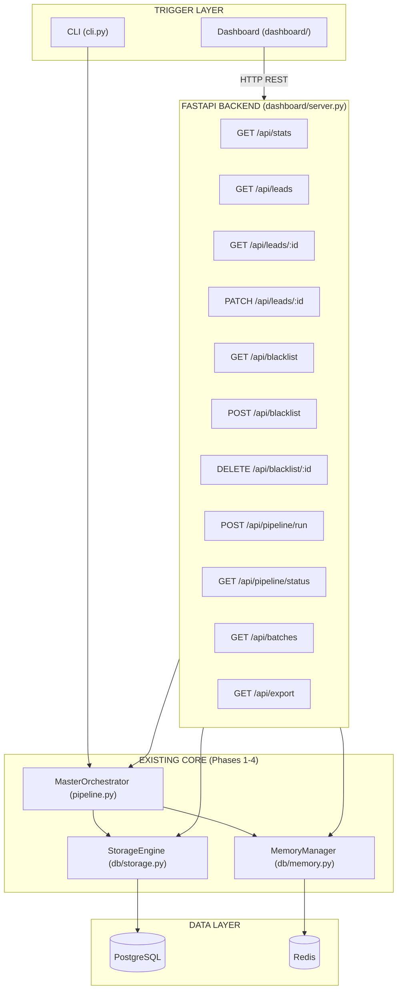
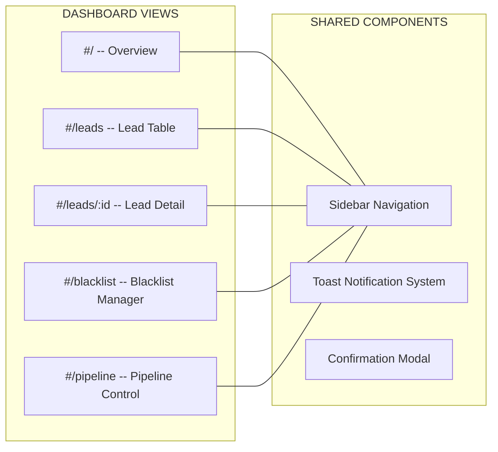
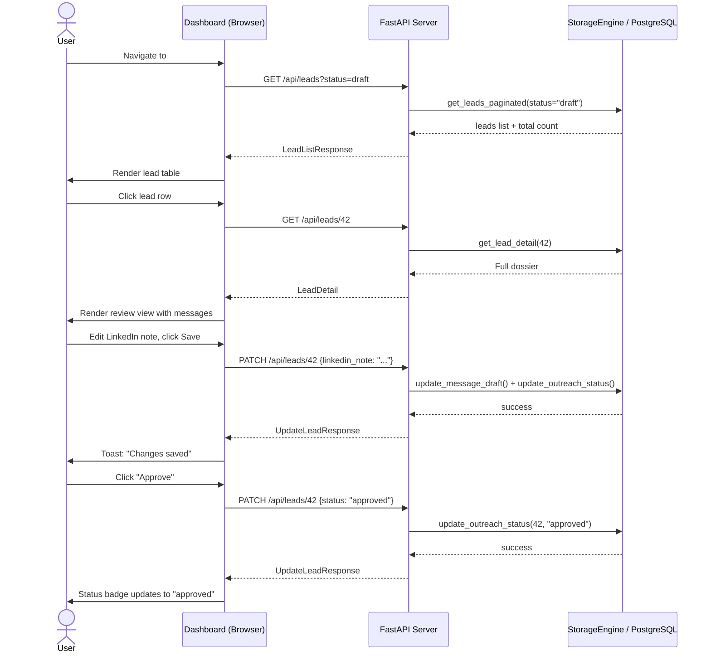
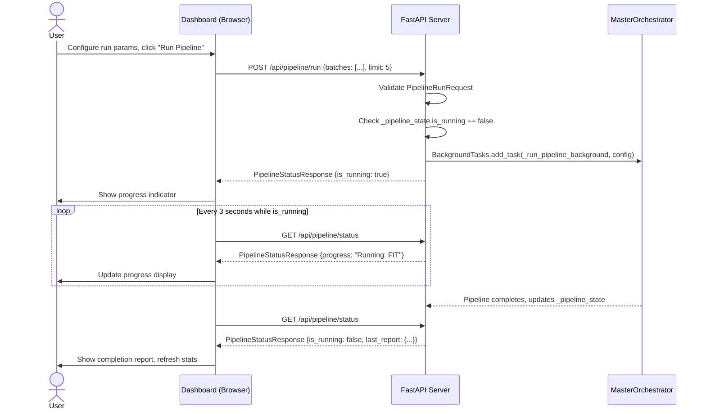

# Phase 5: Outreach Dashboard & Human Review UI

## Executive Summary

Phase 5 adds a **web-based dashboard** to the YC Founder Outreach Agent, transforming the CLI-only workflow into a visual command center where you can review discovered leads, inspect generated messages, approve/edit/reject outreach, manage the blacklist, trigger pipeline runs, and monitor funnel conversion — all from the browser.

The dashboard is a **local-first, single-user** tool that reads and writes to the same PostgreSQL/SQLite + Redis infrastructure that Phases 1–4 already use. No new databases. No new ORMs. No cloud deployment.

> [!IMPORTANT]
> **Architectural Constraint: Preserve Phase 1–4 Architecture**
> The dashboard is a **read/write UI layer on top of existing infrastructure**. It does NOT replace the CLI, does NOT replace PostgreSQL/Redis, does NOT introduce an ORM, and does NOT replace the deterministic `MasterOrchestrator`. The CLI and the dashboard share the same `StorageEngine`, `MemoryManager`, and `pipeline.py` — they are two triggers into the same system.

---

## 1. Architecture Overview

### 1.1 System Context Diagram



### 1.2 Core Design Decisions

| Decision | Choice | Rationale (agent-architecture-advisor) |
|---|---|---|
| **Backend framework** | FastAPI (async, Pydantic-native) | Already in the candidate's skill set; Pydantic request/response validation aligns with existing contracts; async compatibility with `MasterOrchestrator` |
| **Frontend framework** | Vanilla HTML + CSS + JavaScript (single `index.html`) | Single-user local tool; no build step, no npm, no node_modules; instant reload during development; maximizes simplicity |
| **API pattern** | REST JSON endpoints served by FastAPI | Dashboard is a CRUD UI over existing data; REST is the simplest correct choice. No WebSocket complexity needed for single-user local tool |
| **Pipeline trigger** | Async background task via FastAPI `BackgroundTasks` | Pipeline runs take 30-300s; must not block the HTTP response. Status polled via `/api/pipeline/status` |
| **State management** | Server-authoritative — all state lives in PostgreSQL/Redis via `StorageEngine` | Per agent-architecture-advisor: "Session memory != application state — the database is the record of what is true." The frontend is a stateless renderer |
| **Authentication** | None (localhost-only binding) | Single-user local development tool; binding to `127.0.0.1` prevents external access |
| **Static file serving** | FastAPI `StaticFiles` mount | Zero additional dependencies; serves `index.html`, CSS, and JS directly |

> [!NOTE]
> **Why not a React/Next.js SPA?**
> This is a personal local tool, not a multi-user production app. A single `index.html` with vanilla JS eliminates the build toolchain entirely — no `npm install`, no bundler, no transpiler, no `node_modules/`. The tradeoff (no component framework, manual DOM updates) is acceptable for ~5 views. If the dashboard grows beyond ~15 views, consider migrating to a lightweight SPA framework.

---

## 2. File Manifest

### [NEW] Files to Create

| File | Purpose |
|---|---|
| `dashboard/__init__.py` | Package marker |
| `dashboard/server.py` | FastAPI application with all REST endpoints |
| `dashboard/api_models.py` | Pydantic request/response schemas for all API endpoints |
| `dashboard/static/index.html` | Single-page dashboard UI (HTML structure) |
| `dashboard/static/styles.css` | Dashboard stylesheet (dark theme, glassmorphism, responsive) |
| `dashboard/static/app.js` | Dashboard JavaScript (fetch API, DOM rendering, state management) |
| `tests/test_dashboard.py` | API endpoint integration tests (all mocked, no live DB) |
| `Specs/phase5_dashboard/spec.md` | This specification (for audit trail) |

### [MODIFY] Files to Update

| File | Change |
|---|---|
| `config/settings.py` | Add `dashboard_host`, `dashboard_port`, `dashboard_auto_open_browser` settings |
| `db/storage.py` | Add `get_lead_detail()`, `get_batch_list()`, `get_leads_paginated()`, `update_message_draft()` query helpers |
| `requirements.txt` | Add `fastapi>=0.115.0` and `uvicorn[standard]>=0.30.0` |
| `cli.py` | Add `dashboard` subcommand to launch the server |

---

## 3. Detailed Component Specifications

### 3.1 `dashboard/api_models.py` — Pydantic API Contracts

> [!NOTE]
> Per agent-architecture-advisor: "Contracts, not comments — define expected output as a Pydantic model enforced at runtime." Every API request and response is typed.

```python
from datetime import datetime
from typing import Any, Dict, List, Literal, Optional
from pydantic import BaseModel, Field


# --- Stats & Funnel ---

class FunnelStats(BaseModel):
    """Aggregate metrics for the dashboard overview cards."""
    total_startups: int = 0
    total_founders: int = 0
    total_evaluated: int = 0
    fit_high: int = 0
    fit_medium: int = 0
    fit_low: int = 0
    total_drafts: int = 0
    outreach_draft: int = 0
    outreach_approved: int = 0
    outreach_sent: int = 0
    outreach_replied: int = 0
    outreach_rejected: int = 0
    blacklisted: int = 0


class BatchInfo(BaseModel):
    """Batch name + count for the batch filter dropdown."""
    batch: str
    count: int


# --- Lead List & Detail ---

class LeadSummary(BaseModel):
    """Compact lead row for the leads table view."""
    outreach_id: int
    startup_name: str
    slug: str
    batch: str
    founder_name: str
    founder_title: Optional[str] = None
    linkedin_url: Optional[str] = None
    fit_score: int = 0
    fit_tier: str = "UNKNOWN"
    outreach_status: str = "draft"
    active_channel: str = "linkedin"
    has_drafts: bool = False


class LeadDetail(BaseModel):
    """Full lead dossier for the detail/review view."""
    outreach_id: int
    startup_id: int
    founder_id: int

    # Company
    startup_name: str
    slug: str
    batch: str
    website: Optional[str] = None
    one_liner: Optional[str] = None
    long_description: Optional[str] = None
    industry: Optional[str] = None
    tags: List[str] = Field(default_factory=list)
    is_hiring: bool = False
    jobs_data: List[Dict[str, Any]] = Field(default_factory=list)

    # Founder
    founder_name: str
    founder_title: Optional[str] = None
    founder_bio: Optional[str] = None
    linkedin_url: Optional[str] = None
    twitter_url: Optional[str] = None

    # Fit
    fit_score: int = 0
    fit_tier: str = "UNKNOWN"
    match_rationale: List[str] = Field(default_factory=list)
    contribution_angle: Optional[str] = None

    # Messages
    linkedin_note: Optional[str] = None
    yc_job_note: Optional[str] = None
    cold_email_subject: Optional[str] = None
    cold_email_body: Optional[str] = None

    # Outreach state
    outreach_status: str = "draft"
    active_channel: str = "linkedin"
    selected_message: Optional[str] = None
    notes: Optional[str] = None


class LeadListResponse(BaseModel):
    """Paginated lead list response."""
    leads: List[LeadSummary]
    total: int
    page: int = 1
    per_page: int = 25


# --- Lead Actions ---

class UpdateLeadRequest(BaseModel):
    """Payload for updating a lead's outreach state or message edits."""
    status: Optional[Literal[
        "draft", "approved", "sent", "replied", "rejected", "blacklisted"
    ]] = None
    active_channel: Optional[Literal["linkedin", "yc_job", "email"]] = None
    selected_message: Optional[str] = None
    notes: Optional[str] = None
    # Editable message fields -- human can revise before sending
    linkedin_note: Optional[str] = None
    yc_job_note: Optional[str] = None
    cold_email_subject: Optional[str] = None
    cold_email_body: Optional[str] = None


class UpdateLeadResponse(BaseModel):
    success: bool
    message: str


# --- Blacklist ---

class BlacklistAddRequest(BaseModel):
    identifier_type: Literal["company_name", "founder_name", "linkedin_url", "domain"]
    identifier_value: str = Field(..., min_length=1)
    reason: str = Field(..., min_length=1)


class BlacklistEntryResponse(BaseModel):
    id: int
    identifier_type: str
    identifier_value: str
    reason: str
    created_at: Optional[str] = None


# --- Pipeline Trigger ---

class PipelineRunRequest(BaseModel):
    """Trigger a pipeline run from the dashboard."""
    batches: List[str] = Field(default_factory=lambda: ["Fall 2026"])
    industries: List[str] = Field(default_factory=list)
    limit: Optional[int] = Field(default=5, ge=1, le=500)
    min_fit_score: int = Field(default=50, ge=0, le=100)
    max_concurrency: int = Field(default=5, ge=1, le=20)
    dry_run: bool = False


class PipelineStatusResponse(BaseModel):
    """Current pipeline execution status."""
    is_running: bool
    session_id: Optional[str] = None
    started_at: Optional[str] = None
    progress: Optional[str] = None       # e.g. "Stage 2/4: Founder Extraction"
    last_report: Optional[Dict[str, Any]] = None  # Serialized PipelineReport
```

---

### 3.2 `dashboard/server.py` — FastAPI Application

#### 3.2.1 Application Initialization

```python
import asyncio
import logging
from contextlib import asynccontextmanager
from pathlib import Path
from typing import Optional

from fastapi import BackgroundTasks, FastAPI, HTTPException, Query
from fastapi.responses import FileResponse, StreamingResponse
from fastapi.staticfiles import StaticFiles

from config.settings import settings
from db.storage import storage_engine
from pipeline import MasterOrchestrator, PipelineConfig, PipelineReport

from dashboard.api_models import (
    BatchInfo, BlacklistAddRequest, BlacklistEntryResponse,
    FunnelStats, LeadDetail, LeadListResponse, LeadSummary,
    PipelineRunRequest, PipelineStatusResponse,
    UpdateLeadRequest, UpdateLeadResponse,
)

logger = logging.getLogger("dashboard")

# --- Background pipeline state (module-level, single-user tool) ---
_pipeline_lock = asyncio.Lock()
_pipeline_state: dict = {
    "is_running": False,
    "session_id": None,
    "started_at": None,
    "progress": None,
    "last_report": None,
}


@asynccontextmanager
async def lifespan(app: FastAPI):
    """Initialize DB schema on startup."""
    storage_engine.init_db()
    logger.info(
        f"Dashboard ready at http://{settings.dashboard_host}:{settings.dashboard_port}"
    )
    yield


app = FastAPI(
    title="YC Outreach Dashboard",
    version="1.0.0",
    lifespan=lifespan,
)

# Serve static frontend files
STATIC_DIR = Path(__file__).parent / "static"
app.mount("/static", StaticFiles(directory=str(STATIC_DIR)), name="static")
```

#### 3.2.2 API Endpoint Specifications

| Method | Path | Request | Response | Purpose |
|---|---|---|---|---|
| `GET` | `/` | — | `index.html` | Serve dashboard SPA |
| `GET` | `/api/stats` | — | `FunnelStats` | Overview metric cards |
| `GET` | `/api/batches` | — | `List[BatchInfo]` | Batch filter dropdown |
| `GET` | `/api/leads` | `?status=&tier=&batch=&page=&per_page=&q=` | `LeadListResponse` | Filterable, paginated lead table |
| `GET` | `/api/leads/{outreach_id}` | — | `LeadDetail` | Full lead dossier for review |
| `PATCH` | `/api/leads/{outreach_id}` | `UpdateLeadRequest` | `UpdateLeadResponse` | Update status, edit messages, add notes |
| `GET` | `/api/blacklist` | — | `List[BlacklistEntryResponse]` | List all blacklisted entities |
| `POST` | `/api/blacklist` | `BlacklistAddRequest` | `BlacklistEntryResponse` | Add to blacklist |
| `DELETE` | `/api/blacklist/{id}` | — | `UpdateLeadResponse` | Remove from blacklist |
| `POST` | `/api/pipeline/run` | `PipelineRunRequest` | `PipelineStatusResponse` | Trigger async pipeline run |
| `GET` | `/api/pipeline/status` | — | `PipelineStatusResponse` | Poll pipeline progress |
| `GET` | `/api/export` | `?min_score=&format=csv\|json` | File download | Export qualified leads |

#### 3.2.3 Endpoint Implementation Pseudocode

```python
@app.get("/")
async def serve_dashboard():
    """Serve the main dashboard page."""
    return FileResponse(STATIC_DIR / "index.html")


@app.get("/api/stats", response_model=FunnelStats)
async def get_stats():
    """Returns aggregate funnel stats from StorageEngine."""
    raw = storage_engine.get_pipeline_stats()
    outreach = raw.get("outreach_status", {})
    return FunnelStats(
        total_startups=raw.get("startups", 0),
        total_founders=raw.get("founders", 0),
        total_evaluated=raw.get("fit_evaluations", 0),
        fit_high=raw.get("fit_high", 0),
        fit_medium=raw.get("fit_medium", 0),
        fit_low=raw.get("fit_low", 0),
        total_drafts=raw.get("message_drafts", 0),
        outreach_draft=outreach.get("draft", 0),
        outreach_approved=outreach.get("approved", 0),
        outreach_sent=outreach.get("sent", 0),
        outreach_replied=outreach.get("replied", 0),
        outreach_rejected=outreach.get("rejected", 0),
        blacklisted=raw.get("blacklisted", 0),
    )


@app.get("/api/leads", response_model=LeadListResponse)
async def list_leads(
    status: Optional[str] = Query(None),
    tier: Optional[str] = Query(None),
    batch: Optional[str] = Query(None),
    q: Optional[str] = Query(None, description="Search by company or founder name"),
    page: int = Query(1, ge=1),
    per_page: int = Query(25, ge=1, le=100),
):
    """Paginated, filterable lead listing from StorageEngine."""
    leads, total = storage_engine.get_leads_paginated(
        status=status, fit_tier=tier, batch=batch,
        search_query=q, page=page, per_page=per_page,
    )
    return LeadListResponse(leads=leads, total=total, page=page, per_page=per_page)


@app.get("/api/leads/{outreach_id}", response_model=LeadDetail)
async def get_lead_detail(outreach_id: int):
    """Full enriched lead dossier for human review."""
    detail = storage_engine.get_lead_detail(outreach_id)
    if not detail:
        raise HTTPException(404, f"Lead with outreach_id={outreach_id} not found")
    return LeadDetail(**detail)


@app.patch("/api/leads/{outreach_id}", response_model=UpdateLeadResponse)
async def update_lead(outreach_id: int, payload: UpdateLeadRequest):
    """Update outreach status, edit messages, or add notes.

    If payload.status == 'blacklisted', also adds to the blacklist table.
    If payload contains edited message fields, updates message_drafts table.
    """
    # 1. Get existing lead to find startup_id / founder_id
    detail = storage_engine.get_lead_detail(outreach_id)
    if not detail:
        raise HTTPException(404, f"Lead not found")

    # 2. Update message drafts if any message fields provided
    msg_fields = {k: v for k, v in {
        "linkedin_note": payload.linkedin_note,
        "yc_job_note": payload.yc_job_note,
        "cold_email_subject": payload.cold_email_subject,
        "cold_email_body": payload.cold_email_body,
    }.items() if v is not None}

    if msg_fields:
        storage_engine.update_message_draft(
            startup_id=detail["startup_id"],
            founder_id=detail["founder_id"],
            **msg_fields,
        )

    # 3. Update outreach record status / channel / notes
    if payload.status or payload.active_channel or payload.notes or payload.selected_message:
        storage_engine.update_outreach_status(
            record_id=outreach_id,
            status=payload.status or detail["outreach_status"],
            selected_message=payload.selected_message,
            notes=payload.notes,
        )

    # 4. Handle blacklist cascade
    if payload.status == "blacklisted":
        storage_engine.add_to_blacklist(
            identifier_type="company_name",
            identifier_value=detail["startup_name"],
            reason=payload.notes or "Blacklisted via dashboard",
        )

    return UpdateLeadResponse(success=True, message="Lead updated successfully")


@app.post("/api/pipeline/run", response_model=PipelineStatusResponse)
async def trigger_pipeline(payload: PipelineRunRequest, background_tasks: BackgroundTasks):
    """Launches the pipeline as an async background task.

    Returns immediately with is_running=True.
    Rejects if a pipeline is already running (single-user, one-at-a-time).
    """
    async with _pipeline_lock:
        if _pipeline_state["is_running"]:
            raise HTTPException(409, "A pipeline run is already in progress")

    config = PipelineConfig(
        batches=payload.batches,
        industries=payload.industries,
        limit=payload.limit,
        min_fit_score=payload.min_fit_score,
        max_concurrency=payload.max_concurrency,
        dry_run=payload.dry_run,
    )
    background_tasks.add_task(_run_pipeline_background, config)
    _pipeline_state["is_running"] = True
    _pipeline_state["progress"] = "Starting..."
    return PipelineStatusResponse(is_running=True, progress="Starting...")


async def _run_pipeline_background(config: PipelineConfig):
    """Runs the MasterOrchestrator and updates _pipeline_state."""
    def on_progress(event: str, payload: dict):
        if event == "stage_start":
            stage = payload.get("stage", "").upper()
            _pipeline_state["progress"] = f"Running: {stage}"
        elif event == "stage_complete":
            stage = payload.get("stage", "").upper()
            _pipeline_state["progress"] = f"Completed: {stage}"

    try:
        orchestrator = MasterOrchestrator(config=config, progress_callback=on_progress)
        report = await orchestrator.run()
        _pipeline_state["last_report"] = report.model_dump(mode="json")
        _pipeline_state["progress"] = "Pipeline complete"
    except Exception as e:
        _pipeline_state["progress"] = f"Pipeline failed: {e}"
        _pipeline_state["last_report"] = None
    finally:
        _pipeline_state["is_running"] = False
```

> [!NOTE]
> **Why `BackgroundTasks` and not Celery/RQ?**
> This is a single-user local tool. There is exactly one pipeline running at a time. FastAPI's built-in `BackgroundTasks` is the simplest correct choice for fire-and-forget async execution. Celery/RQ would add Redis broker configuration, worker processes, and serialization complexity for zero benefit at this scale.

---

### 3.3 `dashboard/static/` — Frontend UI

#### 3.3.1 View Architecture (Single-Page, Client-Side Routing)

The dashboard is a single `index.html` that uses hash-based client-side routing (`#/`, `#/leads`, `#/leads/:id`, `#/blacklist`, `#/pipeline`) to switch between views without page reloads.



#### 3.3.2 View Specifications

##### View 1: Overview (`#/`)

The landing view. Displays high-level funnel metrics and conversion indicators.

| Component | Data Source | Interaction |
|---|---|---|
| **Metric Cards** (6 cards in 3x2 grid) | `GET /api/stats` | Click navigates to filtered lead list |
| -> Total Startups | `total_startups` | -> `#/leads` |
| -> High Fit | `fit_high` | -> `#/leads?tier=HIGH` |
| -> Medium Fit | `fit_medium` | -> `#/leads?tier=MEDIUM` |
| -> Pending Review | `outreach_draft` | -> `#/leads?status=draft` |
| -> Approved | `outreach_approved` | -> `#/leads?status=approved` |
| -> Sent | `outreach_sent` | -> `#/leads?status=sent` |
| **Funnel Visualization** | `GET /api/stats` | Static horizontal funnel bar |
| **Recent Activity** | `GET /api/leads?per_page=5` | Click row -> `#/leads/:id` |

**Design**:
- Dark background (`#0f1117`) with glassmorphism cards (semi-transparent dark panels with `backdrop-filter: blur`)
- Metric values use large bold numerals with color-coded accents:
  - High Fit: emerald green (`#10b981`)
  - Medium Fit: amber (`#f59e0b`)
  - Pending: sky blue (`#38bdf8`)
  - Sent: purple (`#a78bfa`)
- Subtle count-up animation on card values when view loads
- Funnel bar shows proportional widths: Discovered -> Evaluated -> Qualified -> Drafted -> Sent

##### View 2: Lead Table (`#/leads`)

Filterable, sortable, paginated table of all leads.

| Component | Data Source | Interaction |
|---|---|---|
| **Filter Bar** | Client-side state | Batch dropdown (`GET /api/batches`), Status dropdown, Fit Tier dropdown, Search input |
| **Leads Table** | `GET /api/leads?...` | Columns: Company, Founder, Batch, Fit Score, Tier, Status, Channel, Actions |
| **Pagination** | Response `total` + `page` | Prev/Next page buttons |
| **Quick Actions** | Per-row buttons | Approve, Reject, View Detail |

**Design**:
- Table rows alternate between `#1a1d28` and `#1e2130`
- Fit tier badges: HIGH = green pill, MEDIUM = amber pill, LOW = red pill
- Status badges: draft = gray, approved = blue, sent = purple, replied = green, rejected = red, blacklisted = dark red
- Row hover highlights with a subtle left-border glow matching the tier color
- Search debounces 300ms before triggering API call
- Column headers clickable for client-side sort (score, name, status)

##### View 3: Lead Detail (`#/leads/:id`)

Full-screen lead review and message editing view. This is the primary human-in-the-loop workflow surface.

| Component | Data Source | Interaction |
|---|---|---|
| **Company Header** | `LeadDetail` | Company name, batch badge, one-liner, website link, YC URL |
| **Founder Card** | `LeadDetail` | Name, title, bio, LinkedIn link, Twitter link |
| **Fit Evaluation Panel** | `LeadDetail` | Score gauge, tier badge, rationale bullets, contribution angle |
| **Message Editor: LinkedIn** | `LeadDetail.linkedin_note` | Editable `<textarea>` with live character counter (X / 300), save button |
| **Message Editor: YC Job Note** | `LeadDetail.yc_job_note` | Editable `<textarea>`, save button |
| **Message Editor: Cold Email** | `LeadDetail.cold_email_subject` + `cold_email_body` | Editable subject + body textareas, save button |
| **Channel Selector** | `LeadDetail.active_channel` | Radio: LinkedIn / YC Job / Email — selects which message is "active" for outreach |
| **Status Actions** | `LeadDetail.outreach_status` | Buttons: Approve -> Sent -> Replied, or Reject, or Blacklist (with confirmation modal) |
| **Notes Field** | `LeadDetail.notes` | Free-text `<textarea>` for human reviewer notes |
| **Navigation** | — | Previous Lead / Next Lead buttons for sequential review workflow |

**Design**:
- Two-column layout on desktop (company/founder left, messages/actions right)
- Single-column stacked on tablet/mobile
- LinkedIn character counter turns red when over limit
- Message textareas use monospace font (`JetBrains Mono` or `Source Code Pro`) for readability
- "Save" button triggers `PATCH /api/leads/:id` with only the changed fields
- Unsaved changes detection: warn before navigation
- Status transition flow is visually represented as a horizontal stepper:
  `draft -> approved -> sent -> replied` with the current step highlighted
- Blacklist action requires a confirmation modal with mandatory reason text

##### View 4: Blacklist Manager (`#/blacklist`)

| Component | Data Source | Interaction |
|---|---|---|
| **Blacklist Table** | `GET /api/blacklist` | Columns: Type, Identifier, Reason, Date Added, Actions |
| **Add Form** | — | Type dropdown, Identifier input, Reason input, Submit button |
| **Remove Action** | Per-row button | Confirmation modal -> `DELETE /api/blacklist/:id` |

##### View 5: Pipeline Control (`#/pipeline`)

| Component | Data Source | Interaction |
|---|---|---|
| **Run Configuration Form** | — | Batch multi-select, Industry tags, Limit slider, Min Score slider, Dry Run toggle |
| **Run Button** | `POST /api/pipeline/run` | Disabled while pipeline is running |
| **Status Panel** | `GET /api/pipeline/status` (polled every 3s while running) | Progress indicator, current stage name, elapsed time |
| **Last Run Report** | `PipelineStatusResponse.last_report` | Formatted summary: discovered/extracted/evaluated/qualified/drafted counts, errors |

**Design**:
- Configuration form uses modern slider inputs with numeric labels
- While pipeline is running: pulsing blue progress indicator, stage transitions animate in
- Last Run Report rendered as a card matching the CLI `format_pipeline_report` output
- If no pipeline has been run, display an invitation prompt

---

## 4. Frontend Design System

### 4.1 Color Palette (Dark Theme)

```css
:root {
    /* Base */
    --bg-primary:     #0f1117;
    --bg-secondary:   #1a1d28;
    --bg-tertiary:    #1e2130;
    --bg-card:        rgba(30, 33, 48, 0.8);
    --bg-glass:       rgba(255, 255, 255, 0.05);

    /* Text */
    --text-primary:   #e4e4e7;
    --text-secondary: #a1a1aa;
    --text-muted:     #71717a;

    /* Accent */
    --accent-primary:  #6366f1;  /* Indigo */
    --accent-hover:    #818cf8;

    /* Semantic */
    --color-success:   #10b981;  /* Emerald */
    --color-warning:   #f59e0b;  /* Amber */
    --color-danger:    #ef4444;  /* Red */
    --color-info:      #38bdf8;  /* Sky */
    --color-purple:    #a78bfa;  /* Violet */

    /* Borders */
    --border-subtle:   rgba(255, 255, 255, 0.08);
    --border-active:   rgba(99, 102, 241, 0.5);

    /* Glass */
    --glass-blur:      12px;
    --glass-border:    1px solid rgba(255, 255, 255, 0.1);
}
```

### 4.2 Typography

```css
@import url('https://fonts.googleapis.com/css2?family=Inter:wght@400;500;600;700&family=JetBrains+Mono:wght@400;500&display=swap');

body {
    font-family: 'Inter', -apple-system, BlinkMacSystemFont, sans-serif;
}

textarea, code, .monospace {
    font-family: 'JetBrains Mono', 'Fira Code', monospace;
}
```

### 4.3 Component Styling Patterns

```css
/* Glassmorphism card */
.card {
    background: var(--bg-card);
    backdrop-filter: blur(var(--glass-blur));
    border: var(--glass-border);
    border-radius: 12px;
    padding: 24px;
    transition: transform 0.2s ease, box-shadow 0.2s ease;
}

.card:hover {
    transform: translateY(-2px);
    box-shadow: 0 8px 32px rgba(0, 0, 0, 0.3);
}

/* Tier badge pill */
.badge { border-radius: 9999px; padding: 4px 12px; font-size: 12px; font-weight: 600; }
.badge-high   { background: rgba(16, 185, 129, 0.15); color: #10b981; }
.badge-medium { background: rgba(245, 158, 11, 0.15); color: #f59e0b; }
.badge-low    { background: rgba(239, 68, 68, 0.15);  color: #ef4444; }

/* Status badge */
.status-draft     { background: rgba(161, 161, 170, 0.15); color: #a1a1aa; }
.status-approved  { background: rgba(56, 189, 248, 0.15);  color: #38bdf8; }
.status-sent      { background: rgba(167, 139, 250, 0.15); color: #a78bfa; }
.status-replied   { background: rgba(16, 185, 129, 0.15);  color: #10b981; }
.status-rejected  { background: rgba(239, 68, 68, 0.15);   color: #ef4444; }
```

---

## 5. New Storage Queries

The following queries are added to `db/storage.py` to support dashboard-specific views:

### 5.1 `get_leads_paginated()`

```python
@staticmethod
def get_leads_paginated(
    status: Optional[str] = None,
    fit_tier: Optional[str] = None,
    batch: Optional[str] = None,
    search_query: Optional[str] = None,
    page: int = 1,
    per_page: int = 25,
) -> Tuple[List[Dict[str, Any]], int]:
    """Paginated lead listing with server-side filtering.

    Returns (leads, total_count) tuple for pagination.

    Base query JOINs: outreach_records -> startups -> founders -> fit_evaluations -> message_drafts
    WHERE clauses built dynamically from provided filter params.
    Uses LIMIT/OFFSET for pagination and a separate COUNT query for total.
    """
    ...
```

### 5.2 `get_lead_detail()`

```python
@staticmethod
def get_lead_detail(outreach_id: int) -> Optional[Dict[str, Any]]:
    """Full enriched lead dossier by outreach record ID.

    JOINs: outreach_records -> startups -> founders -> fit_evaluations -> message_drafts
    Returns all fields needed by LeadDetail response model, or None if not found.
    """
    ...
```

### 5.3 `get_batch_list()`

```python
@staticmethod
def get_batch_list() -> List[Dict[str, Any]]:
    """Returns distinct batch names with startup counts for the filter dropdown.

    SELECT batch, COUNT(*) as count FROM startups GROUP BY batch ORDER BY batch DESC
    """
    ...
```

### 5.4 `update_message_draft()`

```python
@staticmethod
def update_message_draft(
    startup_id: int,
    founder_id: int,
    linkedin_note: Optional[str] = None,
    yc_job_note: Optional[str] = None,
    cold_email_subject: Optional[str] = None,
    cold_email_body: Optional[str] = None,
) -> bool:
    """Updates individual message draft fields (human edits from dashboard).

    Uses COALESCE to only update provided (non-None) fields,
    preserving existing values for fields not included in the update.
    """
    ...
```

### 5.5 `get_funnel_stats()`

```python
@staticmethod
def get_funnel_stats() -> Dict[str, int]:
    """Returns conversion funnel metrics for the dashboard overview.

    Extends get_pipeline_stats() with additional breakdowns needed by
    the funnel visualization:
    startups -> with_founders -> evaluated -> qualified -> drafted -> approved -> sent
    """
    ...
```

---

## 6. Configuration Additions (`config/settings.py`)

```python
# Phase 5: Dashboard
dashboard_host: str = Field(
    default="127.0.0.1",
    description="Dashboard server bind address (localhost only for security)",
)
dashboard_port: int = Field(
    default=8501, ge=1024, le=65535,
    description="Dashboard server port",
)
dashboard_auto_open_browser: bool = Field(
    default=True,
    description="Automatically open browser when dashboard launches",
)
```

> [!IMPORTANT]
> **Security: Localhost-only binding.**
> The dashboard binds to `127.0.0.1` by default, ensuring it is unreachable from external networks. This is a personal local tool — no authentication system is needed. If the user sets `dashboard_host=0.0.0.0`, they accept the risk.

---

## 7. CLI Extension (`cli.py`)

Add a new `dashboard` subcommand:

```python
# Subcommand: dashboard
subparsers.add_parser("dashboard", help="Launch the web dashboard")


# In main():
elif args.subcommand == "dashboard":
    sys.exit(handle_dashboard(args))


def handle_dashboard(args: argparse.Namespace) -> int:
    """Launches the FastAPI dashboard server."""
    import uvicorn
    from dashboard.server import app

    print(f"[OK] Starting YC Outreach Dashboard at "
          f"http://{settings.dashboard_host}:{settings.dashboard_port}")

    if settings.dashboard_auto_open_browser:
        import webbrowser
        import threading
        def _open():
            import time; time.sleep(1.5)
            webbrowser.open(
                f"http://{settings.dashboard_host}:{settings.dashboard_port}"
            )
        threading.Thread(target=_open, daemon=True).start()

    uvicorn.run(
        app,
        host=settings.dashboard_host,
        port=settings.dashboard_port,
        log_level="info",
    )
    return 0
```

Usage:

```bash
# Launch dashboard (opens browser automatically)
python cli.py dashboard

# Or use uvicorn directly for development with auto-reload
uvicorn dashboard.server:app --reload --port 8501
```

---

## 8. Data Flow Diagrams

### 8.1 Lead Review Workflow (Primary User Flow)



### 8.2 Pipeline Trigger Workflow



---

## 9. Testing Strategy

### 9.1 `tests/test_dashboard.py` — API Integration Tests (All Mocked)

> [!IMPORTANT]
> Per agent-architecture-advisor: "Never run live LLM calls or live DB connections in the main test suite. Mock the storage and test YOUR code: request validation, error handling, response formatting."

We use FastAPI's `TestClient` with a patched `StorageEngine` that returns deterministic fixture data.

| Test Case | What It Validates |
|---|---|
| `test_get_stats_returns_funnel_metrics` | `/api/stats` returns valid `FunnelStats` with correct field mapping |
| `test_get_leads_paginated_default` | `/api/leads` returns valid `LeadListResponse` with correct structure |
| `test_get_leads_filtered_by_status` | `/api/leads?status=draft` only returns leads with `outreach_status=draft` |
| `test_get_leads_filtered_by_tier` | `/api/leads?tier=HIGH` only returns leads with `fit_tier=HIGH` |
| `test_get_leads_filtered_by_batch` | `/api/leads?batch=Fall 2026` only returns leads from that batch |
| `test_get_leads_search` | `/api/leads?q=deepmark` filters by company/founder name match |
| `test_get_lead_detail_found` | `/api/leads/42` returns full `LeadDetail` with all joined fields |
| `test_get_lead_detail_not_found` | `/api/leads/999` returns 404 |
| `test_update_lead_status` | `PATCH /api/leads/42 {status: "approved"}` calls `update_outreach_status` correctly |
| `test_update_lead_messages` | `PATCH /api/leads/42 {linkedin_note: "..."}` calls `update_message_draft` correctly |
| `test_update_lead_blacklist_cascades` | `PATCH {status: "blacklisted"}` also calls `add_to_blacklist` |
| `test_get_blacklist_list` | `/api/blacklist` returns all entries |
| `test_add_blacklist_entry` | `POST /api/blacklist` with valid payload creates entry |
| `test_add_blacklist_validation_error` | `POST /api/blacklist` with empty `identifier_value` returns 422 |
| `test_delete_blacklist_entry` | `DELETE /api/blacklist/1` calls `remove_from_blacklist` |
| `test_trigger_pipeline_success` | `POST /api/pipeline/run` returns `is_running=True` |
| `test_trigger_pipeline_conflict` | Second `POST /api/pipeline/run` while running returns 409 |
| `test_pipeline_status_idle` | `GET /api/pipeline/status` when idle returns `is_running=False` |
| `test_pipeline_status_running` | `GET /api/pipeline/status` while running returns current progress |
| `test_export_csv` | `GET /api/export?format=csv&min_score=50` returns CSV with correct headers |
| `test_export_json` | `GET /api/export?format=json&min_score=50` returns JSON array |
| `test_batches_endpoint` | `GET /api/batches` returns list of `BatchInfo` objects |
| `test_serve_index_html` | `GET /` returns 200 with HTML content type |

### 9.2 Mock Strategy

```python
import pytest
from unittest.mock import patch, MagicMock
from fastapi.testclient import TestClient
from dashboard.server import app

@pytest.fixture
def client():
    """TestClient with mocked StorageEngine for deterministic API tests."""
    return TestClient(app)

@pytest.fixture
def mock_storage():
    """Patches StorageEngine methods with deterministic test data."""
    with patch("dashboard.server.storage_engine") as mock:
        mock.get_pipeline_stats.return_value = {
            "startups": 42, "founders": 38, "fit_evaluations": 35,
            "fit_high": 8, "fit_medium": 12, "fit_low": 15,
            "message_drafts": 20,
            "outreach_status": {"draft": 12, "approved": 5, "sent": 3},
            "blacklisted": 2,
        }
        mock.get_leads_paginated.return_value = (
            [{"outreach_id": 1, "startup_name": "TestCorp", "slug": "testcorp",
              "batch": "Fall 2026", "founder_name": "Jane Doe",
              "fit_score": 85, "fit_tier": "HIGH",
              "outreach_status": "draft", "active_channel": "linkedin",
              "has_drafts": True}],
            1,
        )
        yield mock
```

---

## 10. Verification Plan

### 10.1 Automated Tests

```bash
# Unit + integration tests (all mocked, zero tokens, zero network)
python -m pytest tests/ -v --tb=short

# Expect: 105 existing + ~23 new dashboard tests = ~128 tests passing
```

### 10.2 Live Integration Test

```bash
# Launch dashboard with live database
python cli.py dashboard

# Then in browser verify:
# 1. Overview cards display correct counts from PostgreSQL
# 2. Lead table loads with existing data, filters work
# 3. Lead detail view shows full dossier with editable messages
# 4. Edit a LinkedIn note -> save -> refresh -> edit persists
# 5. Approve a lead -> status badge updates
# 6. Blacklist a lead -> blacklist table shows new entry
# 7. Trigger a pipeline run -> progress indicator -> completion report
# 8. Export CSV -> download contains expected columns
```

### 10.3 Manual Verification

```bash
# Verify dashboard CLI subcommand
python cli.py dashboard --help

# Verify API responses directly
curl http://127.0.0.1:8501/api/stats
curl http://127.0.0.1:8501/api/leads?status=draft
curl http://127.0.0.1:8501/api/batches
```

---

## 11. Responsive Layout

```
Desktop (>= 1024px)
+----------+----------------------------------------------+
| Sidebar  |  Main Content Area                           |
| (220px)  |                                              |
|          |  +--------+ +--------+ +--------+            |
| Overview |  | Card 1 | | Card 2 | | Card 3 |            |
| Leads    |  +--------+ +--------+ +--------+            |
| Blacklist|  +--------+ +--------+ +--------+            |
| Pipeline |  | Card 4 | | Card 5 | | Card 6 |            |
|          |  +--------+ +--------+ +--------+            |
|          |                                              |
|          |  +------------------------------------------+|
|          |  |  Lead Table / Detail / Pipeline View      ||
|          |  +------------------------------------------+|
+----------+----------------------------------------------+

Tablet/Mobile (< 1024px)
+----------------------------------------------------+
| Hamburger Menu (sidebar collapses to overlay)      |
| +------------------------------------------------+ |
| | Cards stack 2x3 -> 1x6                         | |
| +------------------------------------------------+ |
| +------------------------------------------------+ |
| | Table scrolls horizontally                     | |
| +------------------------------------------------+ |
+----------------------------------------------------+
```

---

## 12. Dependencies

### New pip dependencies:

| Package | Version | Purpose |
|---|---|---|
| `fastapi` | `>=0.115.0` | REST API framework with Pydantic validation |
| `uvicorn[standard]` | `>=0.30.0` | ASGI server for FastAPI |

### No frontend build dependencies:

The frontend is plain HTML + CSS + JavaScript. No npm, no Node.js, no webpack, no bundler.

---

## 13. Open Questions

> [!IMPORTANT]
> **Q1: Should the dashboard support real-time live updates (WebSocket) or polling?**
> Option A: **Polling** — `/api/pipeline/status` polled every 3 seconds while a pipeline is running. Simpler, stateless, no WebSocket infrastructure.
> Option B: **WebSocket** — Server pushes stage transitions and progress to the client in real time. Lower latency, more complex connection management.
> Recommendation: **Option A (Polling)** for Phase 5. Pipeline runs happen once every few hours at most. 3-second polling is indistinguishable from real-time for this use case. WebSocket can be added in a future phase if pipeline runs become frequent enough to justify it.

> [!IMPORTANT]
> **Q2: Should the dashboard include inline message regeneration (re-trigger LLM)?**
> Option A: **No LLM regeneration in dashboard** — edit messages manually, or re-run the full pipeline for new drafts. Keeps the dashboard as a pure review/edit surface.
> Option B: **Per-lead "Regenerate" button** — triggers only the MessageAgent for one specific lead, producing a new draft. Requires an API endpoint that runs a single agent invocation.
> Recommendation: **Option B** — a targeted "Regenerate" button per lead is high value for low complexity. It reuses the existing `MessageAgent.draft_for_startup_and_founder()` and avoids re-running the full pipeline just to get a new message for one lead. The API endpoint would be `POST /api/leads/:id/regenerate`.

> [!IMPORTANT]
> **Q3: Dashboard port — `8501` or `8000`?**
> `settings.py` already has `server_host` and `server_port` (default `8000`). Should the dashboard reuse those fields, or use separate `dashboard_port` / `dashboard_host` fields to allow CLI pipeline and dashboard to run independently?
> Recommendation: **Separate fields** (`dashboard_host`, `dashboard_port = 8501`). This allows `cli.py run` and `cli.py dashboard` to operate simultaneously without port conflicts, and avoids confusing "server" semantics between the pipeline's internal API surface and the dashboard's user-facing UI.
